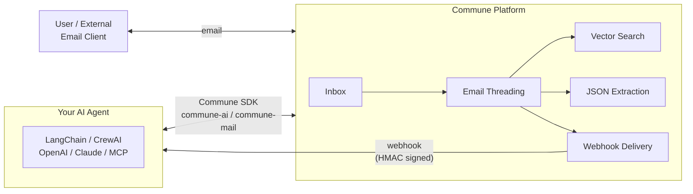

[](https://pypi.org/project/commune-mail/)
[](https://www.npmjs.com/package/commune-ai)
[](LICENSE)
[](langchain/)
[](crewai/)
[](mcp-server/)
[](https://github.com/shanjai-raj/email-for-agents/actions/workflows/ci.yml)

## Interactive Notebooks

Run these notebooks directly in your browser — no setup required:

| Notebook | Framework | Open |
|----------|-----------|------|
| Customer Support Agent | LangChain | [](https://colab.research.google.com/github/shanjai-raj/commune-cookbook/blob/main/notebooks/langchain_customer_support.ipynb) |
| Multi-Agent Email Crew | CrewAI | [](https://colab.research.google.com/github/shanjai-raj/commune-cookbook/blob/main/notebooks/crewai_multi_agent_crew.ipynb) |
| Email Agent with OpenAI | OpenAI Agents SDK | [](https://colab.research.google.com/github/shanjai-raj/commune-cookbook/blob/main/notebooks/openai_agents_email.ipynb) |
| Structured Email Extraction | Any framework | [](https://colab.research.google.com/github/shanjai-raj/commune-cookbook/blob/main/notebooks/structured_extraction.ipynb) |
| 5-Minute Quickstart | Python | [](https://colab.research.google.com/github/shanjai-raj/commune-cookbook/blob/main/notebooks/quickstart.ipynb) |

---

# Email & SMS for AI Agents

**Give your AI agent a real email address and phone number. Production-ready examples for LangChain, CrewAI, OpenAI Agents SDK, Claude, and MCP. Powered by [Commune](https://commune.email).**

---

## What you get in 60 seconds

```python
# Python — give your agent an email address
from commune import CommuneClient
commune = CommuneClient(api_key="comm_...")
inbox = commune.inboxes.create(local_part="support")
print(inbox.address)  # → support@yourdomain.commune.email
```

```typescript
// TypeScript — give your agent an email address
import { CommuneClient } from 'commune-ai';
const commune = new CommuneClient({ apiKey: process.env.COMMUNE_API_KEY! });
const inbox = await commune.inboxes.create({ localPart: 'support' });
console.log(inbox.address); // → support@yourdomain.commune.email
```

That's a real, deliverable inbox. Your agent can now send replies, search its thread history semantically, extract structured data from inbound mail, and receive webhook events — all with two lines of code.

---

## Examples

| Example | [LangChain](langchain/) | [CrewAI](crewai/) | [OpenAI Agents](openai-agents/) | [Claude](claude/) | [MCP](mcp-server/) | [TypeScript](typescript/) |
|---------|:---------:|:------:|:-------------:|:------:|:---:|:----------:|
| Customer Support Agent | [✅](langchain/) | [✅](crewai/) | [✅](openai-agents/) | [✅](claude/) | [✅](mcp-server/) | [✅](typescript/) |
| Lead Outreach | [✅](langchain/) | [✅](crewai/) | — | [✅](claude/) | — | — |
| Multi-Agent Coordination | — | [✅](crewai/) | — | — | — | [✅](typescript/) |
| SMS Notifications | — | — | — | — | [✅](mcp-server/) | [✅](typescript/) |
| Structured Extraction | — | — | — | [✅](claude/) | [✅](mcp-server/) | — |
| Webhook Handler | — | — | — | — | — | [✅](typescript/) |

---

## Why email for agents?

Most agent frameworks are great at reasoning — but stop short when it comes to communicating with the outside world asynchronously. Email and SMS fill that gap:

- **Agents are async by nature.** A task might take minutes or hours. Email is the right protocol for async handoffs — your agent sends, the user replies when ready, the thread stays intact.
- **Email is the universal protocol.** Every system on the planet speaks SMTP. Your agent can talk to any user, any tool, any service — no integration required.
- **Threading keeps context.** `In-Reply-To` and `References` headers (RFC 5322) tie every message to its thread. Your agent never loses the conversation history.
- **SMS adds the urgency channel.** Some things need immediate attention. Two-way SMS lets your agent escalate, notify, and confirm — all from a real phone number.

### What Commune adds on top of bare SMTP

| Feature | What it means for your agent |
|---------|-------------------------------|
| **Vector search across threads** | `commune.search.threads({ query })` — find relevant past conversations with semantic similarity, not keyword matching |
| **Structured JSON extraction** | Define a JSON schema per inbox; every inbound email is parsed into structured data automatically |
| **Idempotent sends** | Pass an `idempotency_key` and your agent gets a `202` immediately — Commune deduplicates sends within a 24-hour window, so retries never produce duplicate messages |
| **Guaranteed webhook delivery** | 8 retries with exponential backoff and a circuit breaker — your agent's handler will receive every event even through transient failures |

---

## Architecture



---

## Quick start

**1. Install the SDK**

```bash
# Python
pip install commune-mail

# TypeScript / Node
npm install commune-ai
```

**2. Get your API key**

Sign up at [commune.email](https://commune.email) — free tier included, no credit card required.

**3. Pick an example below and follow its README**

Every example is self-contained: install, set your key, run. No boilerplate beyond what you see.

---

## Platform examples

### LangChain

LangChain tools wrap Commune with the `@tool` decorator. Your chain gains `send_email`, `read_inbox`, `search_threads`, and `send_sms` as first-class tools — callable by any LLM in the chain.

| Example | Description |
|---------|-------------|
| [Customer Support Agent](langchain/) | Full support workflow: read inbound, classify, draft reply, send |
| [Lead Outreach](langchain/) | Personalised outreach from a CRM list with open-tracking |

[→ See all LangChain examples](langchain/)

---

### CrewAI

CrewAI agents communicate through shared Commune inboxes — one inbox per crew, or one per agent. Multi-agent coordination over email with full thread history.

| Example | Description |
|---------|-------------|
| [Customer Support Crew](crewai/) | Triage agent → specialist agent → reply agent pipeline |
| [Lead Outreach Crew](crewai/) | Researcher + writer + sender crew for personalised outreach |
| [Multi-Agent Coordination](crewai/) | Agents hand off tasks to each other via email threads |

[→ See all CrewAI examples](crewai/)

---

### OpenAI Agents SDK

Use `@function_tool` to expose Commune capabilities to OpenAI's agent loop. The agent decides when to send, when to search, and when to escalate — you just wire the tools.

| Example | Description |
|---------|-------------|
| [Customer Support Agent](openai-agents/) | Support agent with handoff to human escalation via email |

[→ See all OpenAI Agents examples](openai-agents/)

---

### Claude (Anthropic)

Claude's `tool_use` API maps cleanly to Commune operations. Pass the tool definitions, handle `tool_use` blocks, return `tool_result` — Commune becomes part of Claude's reasoning loop.

| Example | Description |
|---------|-------------|
| [Customer Support Agent](claude/) | Claude reads, extracts, classifies, and replies |
| [Lead Outreach](claude/) | Claude writes and sends personalised cold emails |
| [Structured Extraction](claude/) | Claude uses Commune's per-inbox schema to parse inbound emails |

[→ See all Claude examples](claude/)

---

### MCP Server

Run `commune-mcp` as a local MCP server and connect it to Claude Desktop, Cursor, Windsurf, or any MCP-compatible client. No SDK integration required — the model calls the tools directly.

| Example | Description |
|---------|-------------|
| [Customer Support via MCP](mcp-server/) | Full support workflow through Claude Desktop |
| [SMS Notifications via MCP](mcp-server/) | Provision a number and send SMS from within a chat session |
| [Structured Extraction via MCP](mcp-server/) | Define schemas and extract structured data from inbound mail |

[→ See all MCP examples](mcp-server/)

---

### TypeScript

Full end-to-end TypeScript examples: webhook handlers with HMAC verification, multi-agent coordination with typed payloads, and SMS flows — all typed against the `commune-ai` SDK.

| Example | Description |
|---------|-------------|
| [Customer Support Agent](typescript/) | Express webhook handler + Commune reply flow |
| [Multi-Agent Coordination](typescript/) | Two agents hand off tasks over email with typed thread payloads |
| [SMS Notifications](typescript/) | Provision a number, send SMS, handle inbound replies |
| [Webhook Handler](typescript/) | Reference implementation with `verifyCommuneWebhook` and retry-safe handling |

[→ See all TypeScript examples](typescript/)

---

## Use Cases

Browse examples by what you want to build:

| Use Case | Channel | Complexity |
|----------|---------|------------|
| [AI Email Support Agent](use-cases/customer-support/email-support-agent/) | Email | Beginner |
| [SMS Worker Dispatch](use-cases/hiring-and-recruiting/sms-worker-dispatch/) | SMS | Intermediate |
| [Candidate Outreach Sequence](use-cases/hiring-and-recruiting/candidate-email-outreach/) | Email | Intermediate |
| [Cold Email Outreach](use-cases/sales-and-marketing/cold-outreach-sequences/) | Email | Intermediate |
| [SMS Lead Qualification](use-cases/sales-and-marketing/sms-lead-qualification/) | SMS | Intermediate |
| [Omnichannel Support](use-cases/customer-support/omnichannel-support/) | Email + SMS | Advanced |
| [Incident Alert System](use-cases/notifications-and-alerts/incident-alerts/) | Email + SMS | Advanced |
| [Multi-Agent Coordination](typescript/multi-agent/) | Email | Advanced |

→ [Browse all use cases](use-cases/)

---

## Capabilities

Reference examples for every Commune feature:

| Capability | What it does | Get started |
|-----------|-------------|-------------|
| [Quickstart](capabilities/quickstart/) | Give your agent an email + phone | 3 lines of code |
| [Email Threading](capabilities/email-threading/) | Reply in the same thread | RFC 5322 explained |
| [Structured Extraction](capabilities/structured-extraction/) | Auto-parse email fields to JSON | Zero extra LLM calls |
| [Semantic Search](capabilities/semantic-search/) | Natural language inbox search | Vector embeddings |
| [Webhook Delivery](capabilities/webhook-delivery/) | Receive emails in real time | HMAC verified, 8 retries |
| [Phone Numbers](capabilities/phone-numbers/) | Agent phone number management | Provision + SMS + voice |
| [SMS](capabilities/sms/) | Send, receive, broadcast SMS | Quickstart → mass SMS |

→ [Browse all capabilities](capabilities/)

---

### SMS

Your agent can also send and receive SMS.

```python
# Provision a real phone number
phone = commune.phoneNumbers.provision()
print(phone.number)  # → +14155552671

# Send an SMS
commune.sms.send(
    to="+14155551234",
    body="Your order has shipped.",
    phone_number_id=phone.id,
)
```

Two-way conversations. Semantic search across SMS and email in a single unified index. Escalation from email thread to SMS with one method call.

[→ See SMS examples](sms/)

---

## Key capabilities

<details>
<summary><strong>Email threading</strong></summary>

Commune implements RFC 5322 threading natively. Every message sent through `commune.messages.send()` carries the correct `In-Reply-To` and `References` headers, so replies appear as threads in every email client — Gmail, Outlook, Apple Mail, anything.

Every thread gets a stable `thread_id`. Pass that ID to `commune.messages.send()` and your agent's reply lands in the right conversation — no matter how many hours or days have passed.

```python
# Reply to an existing thread
commune.messages.send(
    to="user@example.com",
    subject="Re: Your support request",
    text="We've resolved your issue.",
    inbox_id=inbox.id,
    thread_id=thread.id,   # keeps the conversation threaded
)
```

</details>

<details>
<summary><strong>Structured extraction</strong></summary>

Define a JSON schema on an inbox and every inbound email will be parsed against it automatically — before your agent ever sees the message. Useful for order confirmations, form submissions, support tickets, or any email with a predictable structure.

```python
commune.inboxes.update(inbox.id, extraction_schema={
    "type": "object",
    "properties": {
        "order_id":   { "type": "string" },
        "issue_type": { "type": "string", "enum": ["damaged", "missing", "wrong_item"] },
        "urgency":    { "type": "string", "enum": ["low", "medium", "high"] },
    }
})

# Every inbound message now has a .extracted field
message = commune.messages.get(message_id)
print(message.extracted)  # → { "order_id": "ORD-123", "issue_type": "damaged", ... }
```

</details>

<details>
<summary><strong>Semantic search</strong></summary>

Every message is embedded at ingest time. Search across an inbox — or across all inboxes — with a natural language query. Results are ranked by semantic similarity, not keyword overlap.

```python
results = commune.search.threads(
    query="customer angry about shipping delay",
    inbox_id=inbox.id,
    limit=5,
)
for thread in results:
    print(thread.subject, thread.score)
```

SMS messages are indexed in the same vector store. One query surfaces relevant context regardless of channel.

</details>

<details>
<summary><strong>Idempotent sends</strong></summary>

Agent loops retry. Networks fail. Commune's idempotency key system means a message is never sent twice, even if your agent calls `messages.send()` multiple times with the same key.

```python
commune.messages.send(
    to="user@example.com",
    subject="Your weekly report",
    text=report_body,
    inbox_id=inbox.id,
    idempotency_key=f"weekly-report-{user_id}-{week}",
)
# Call this 10 times — exactly one email is delivered.
# Every call returns 202 immediately.
```

The deduplication window is 24 hours. Keys are scoped to your account.

</details>

<details>
<summary><strong>Guaranteed webhook delivery</strong></summary>

When a message arrives in your inbox, Commune fires a webhook to your registered endpoint. If your server is down, Commune retries — up to 8 attempts with exponential backoff (1s, 2s, 4s, 8s, 16s, 32s, 64s, 128s). A circuit breaker trips after 5 consecutive failures to protect your server from thundering herd on recovery.

Every webhook payload is HMAC-signed with your webhook secret. Verify the signature before processing:

```typescript
import { verifyCommuneWebhook } from 'commune-ai';

app.post('/webhook', express.raw({ type: 'application/json' }), (req, res) => {
  const payload = verifyCommuneWebhook(req.body, req.headers['commune-signature'], process.env.WEBHOOK_SECRET!);
  // payload is verified — process safely
  res.sendStatus(200);
});
```

</details>

---

## SDK reference

### Python (`commune-mail`)

| Method | Description |
|--------|-------------|
| `commune.inboxes.create(local_part)` | Create an inbox, returns address |
| `commune.messages.send({ to, subject, text, inbox_id, thread_id })` | Send or reply to a thread |
| `commune.threads.list({ inbox_id, limit })` | List conversation threads |
| `commune.threads.messages(thread_id)` | Get all messages in a thread |
| `commune.search.threads({ query, inbox_id })` | Semantic search across threads |
| `commune.threads.set_status(thread_id, status)` | Update thread status |
| `commune.sms.send({ to, body, phone_number_id })` | Send an SMS |
| `commune.phone_numbers.provision()` | Provision a real phone number |

### TypeScript (`commune-ai`)

| Method | Description |
|--------|-------------|
| `commune.inboxes.create({ localPart })` | Create an inbox, returns address |
| `commune.messages.send({ to, subject, text, inboxId, threadId })` | Send or reply to a thread |
| `commune.threads.list({ inboxId, limit })` | List conversation threads |
| `commune.threads.messages(threadId)` | Get all messages in a thread |
| `commune.search.threads({ query, inboxId })` | Semantic search across threads |
| `commune.threads.setStatus(threadId, status)` | Update thread status |
| `commune.sms.send({ to, body, phoneNumberId })` | Send an SMS |
| `commune.phoneNumbers.provision()` | Provision a real phone number |

---

## Contributing

Built something with this? Open a PR — new framework examples, language ports, and real-world use cases are all welcome. See [CONTRIBUTING.md](CONTRIBUTING.md) for guidelines.

---

## Resources

- [Commune documentation](https://commune.email/docs?ref=email-for-agents)
- [Sign up for Commune](https://commune.email)
- [PyPI: commune-mail](https://pypi.org/project/commune-mail/)
- [npm: commune-ai](https://www.npmjs.com/package/commune-ai)
- [GitHub Issues](https://github.com/commune-email/email-for-agents/issues)
