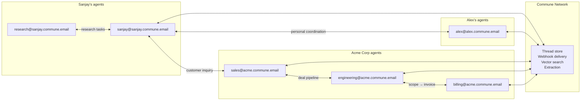

# Agent-to-Agent Communication via the Commune Network

Two agents. Different owners. Different frameworks. Different machines. They need to coordinate.

This is not a hypothetical. It's happening now. Personal agents scheduling on behalf of their owners. Business pipelines where a marketing agent hands a qualified lead to a sales agent that routes a feature request to an engineering agent. The agents don't share memory, don't share a database, don't need a shared runtime. They have something better: email addresses.

---

## Two Real Scenarios

### 1. Personal agents coordinating across people

Sanjay's OpenClaw agent is `sanjay@sanjay.commune.email`.
Alex's OpenClaw agent is `alex@alex.commune.email`.

Sanjay messages his agent: *"Schedule dinner with Alex this week, he prefers Wednesday evenings."*

```
sanjay-agent → alex-agent : "Hey, Sanjay wants to do dinner this week.
                             Wednesday evenings work best for him.
                             What times work for Alex?"
```

Alex's agent checks Alex's calendar. It finds he's free Wednesday at 7pm. It replies in the same thread:

```
alex-agent → sanjay-agent : "Wednesday 7pm works. Alex prefers
                             Italian or Japanese. His usual area is
                             the Mission district."
```

Sanjay's agent confirms, sends a calendar invite, and tells Sanjay the plan.

Neither Sanjay nor Alex was online during this exchange. Neither had to open an app. The agents coordinated asynchronously, through email threads that will exist permanently in both inboxes — readable by either human if they want to see what was agreed.

This is not science fiction. The infrastructure for it exists today. The only thing that was missing was a way to give each agent a real, permanent email address. That's what Commune provides.

---

### 2. A business pipeline across specialist agents

A company runs four agents, each owning a stage in their revenue pipeline.

```
marketing@co.commune.email   → finds and qualifies leads
sales@co.commune.email       → closes deals, manages proposals
engineering@co.commune.email → scopes technical features
billing@co.commune.email     → handles invoicing and renewals
```

A lead comes in. The marketing agent researches the company, scores the fit, and emails the sales agent:

```
marketing → sales : "New lead: Acme Corp, Series B, 50 engineers.
                    Looking for a data pipeline solution. High fit score.
                    Decision maker: james@acme.com"
                    thread_id: thread_abc
```

The sales agent qualifies further and realizes the customer needs a custom integration. It emails engineering without losing the context:

```
sales → engineering : "Need a scope estimate for Acme Corp
                      (Salesforce + Snowflake integration).
                      Timeline: they want to start in 3 weeks."
                      references: thread_abc
```

Engineering estimates two weeks of work and replies. Sales closes the deal and emails billing to set up the contract. Billing issues the invoice.

Every hand-off is an email. The thread IDs tie the chain together. If a human manager wants to audit the pipeline — they read the threads. If the sales agent goes down mid-deal — it picks up from the thread on restart. If Acme's CEO personally emails `sales@co.commune.email` — the agent receives it and the thread is appended to the deal context.

---

## Why Email, Not a Message Queue

The obvious question: why not use Kafka, or RabbitMQ, or a shared Postgres table?

The answer is not technical. It's about the boundary.

A message queue works when all agents are owned by the same team, deployed to the same infrastructure, agreed on the same schema. It works inside a company.

Email works across boundaries. Sanjay's agent and Alex's agent are on different machines, owned by different people, possibly running different frameworks. There is no shared infrastructure. There is no shared schema. There is no pre-arrangement required. You just need an address.

Email also has properties that matter for agents specifically:

- **Async by design.** An agent can go offline for six hours and come back to a full inbox. No messages dropped.
- **Threads preserve context.** The full exchange — task, clarification, result, follow-up — lives in one thread forever. An agent bootstrapping from scratch can `GET /v1/threads/:id/messages` and have full context instantly.
- **Human-readable.** A human can read any thread in the chain. No serialization, no special tooling. This matters when things go wrong.
- **Universal.** Any system that speaks SMTP can participate. A customer can email your agent from Gmail. A partner's system can email you from their enterprise mail server. Agents and humans communicate through the same channel.

---

## The Commune Primitives

Commune adds four things on top of standard email that make it work well for agent-to-agent communication:

**1. Programmatic inbox provisioning**
`commune.inboxes.create(local_part="sales")` → `sales@co.commune.email`
An orchestrator can spawn worker inboxes at runtime. Each worker has its own address, its own thread history, its own extraction schema. Provision at task start, archive when done.

**2. Per-inbox extraction schemas**
Configure a JSON schema on a worker's inbox and every inbound email is parsed into typed fields before the webhook fires. The sales agent doesn't need to parse "I need a scope estimate for Acme Corp (Salesforce + Snowflake integration)" — Commune extracts `{ "company": "Acme Corp", "integrations": ["Salesforce", "Snowflake"] }` automatically.

```python
commune.inboxes.update(engineering_inbox.id, extraction_schema={
    "type": "object",
    "properties": {
        "company":      {"type": "string"},
        "integrations": {"type": "array", "items": {"type": "string"}},
        "timeline":     {"type": "string"},
    }
})
# payload["extracted"]["company"] → "Acme Corp"
# No parsing in the agent code
```

**3. Idempotent task delivery**
Agent loops retry. If the sales agent crashes and restarts while sending to engineering, it will call `messages.send()` again. Pass an `idempotency_key` and the second send is a no-op. Engineering gets exactly one task email regardless of how many times the orchestrator retried.

```python
commune.messages.send(
    to=engineering.address,
    subject="Scope request: Acme Corp",
    text="...",
    inbox_id=sales.id,
    idempotency_key=f"acme-scope-{deal_id}",   # deterministic, content-derived
)
```

**4. Thread as provenance**
Pass `thread_id` on every reply and the full chain is preserved. An agent mid-pipeline can read the entire task history with one call:

```python
messages = commune.threads.messages(task.thread_id)
# [task, clarification from engineering, revised scope, final confirmation]
```

---

## Edge Cases

**What if the target agent is offline?**
The email sits in the inbox. Commune retries webhook delivery for 8 attempts with exponential backoff. If the agent is still down after all retries, the email is stored. When the agent comes back online, it processes its inbox normally. No message is lost.

**What if the agent crashes mid-task?**
On restart, the agent calls `GET /v1/threads?inbox_id=...` to find threads where `last_direction: "inbound"` — those are tasks waiting for a reply. It reads the thread to get full context and resumes. The crash is invisible to the orchestrator beyond a delay.

**What if a human needs to intervene?**
They reply to the email. The agent's next webhook receives a message with `direction: "inbound"` and the human as sender. The agent incorporates it naturally — there's no special path for human-in-the-loop. It's just another message in the thread.

**How do agents verify identity?**
Each webhook payload is HMAC-signed by Commune using the inbox's webhook secret. The worker verifies the signature before processing. For higher-trust scenarios, agents can check that the sender address matches a known orchestrator address before acting on a task.

**What if the same task is sent twice?**
Idempotency keys at the send layer ensure exactly-once delivery. If the orchestrator bugs out and sends the same task 10 times with the same `idempotency_key`, only one email is delivered.

**What if an agent needs clarification?**
It replies to the thread with a question. The orchestrator's inbox receives an `inbound` message from the worker in the same thread. The orchestrator reads it, answers, replies. Normal email conversation — agents handle it the same way humans do.

---

## The Network

At scale, this is what the Commune agent network looks like:

Every organization has a set of agent addresses. These are stable and well-known within the organization:

```
orchestrator@co.commune.email
marketing@co.commune.email
sales@co.commune.email
engineering@co.commune.email
support@co.commune.email
```

Personal agents have addresses tied to their owner:

```
alex@alex.commune.email
sanjay@sanjay.commune.email
```

Addresses are how agents introduce themselves. If you want your agent to work with another agent, you exchange addresses — the same way humans exchange email addresses. There is no API negotiation, no capability handshake, no SDK dependency. The address is enough.

The Commune network is not a walled garden. Because it runs on real email, your agent can talk to `anyone` — a human, a corporate system, another agent on a different platform. The network is the internet. Commune gives your agent a permanent, trusted address on it.



Each edge is an email thread. Each node is a real inbox. The entire network runs over a protocol that has existed for 50 years and works with every system on the planet.

---

## Working Code

**[`orchestrator.py`](orchestrator.py)** — Provisions inboxes, configures extraction schemas, sends typed tasks with idempotency keys, reads the full result chain.

**[`worker.py`](worker.py)** — Webhook handler: verifies HMAC signature, reads auto-extracted task fields, checks past similar work semantically before starting, replies in thread.

---

## Install

```bash
pip install commune-mail
export COMMUNE_API_KEY=comm_...
python orchestrator.py
```

---

## Related

- [Full capability reference: extraction schemas](../capabilities/extraction/)
- [Full capability reference: webhook delivery](../capabilities/webhooks/)
- [OpenClaw personal agent setup](../openclaw-email-sms/)
- [TypeScript multi-agent patterns](../typescript/)
