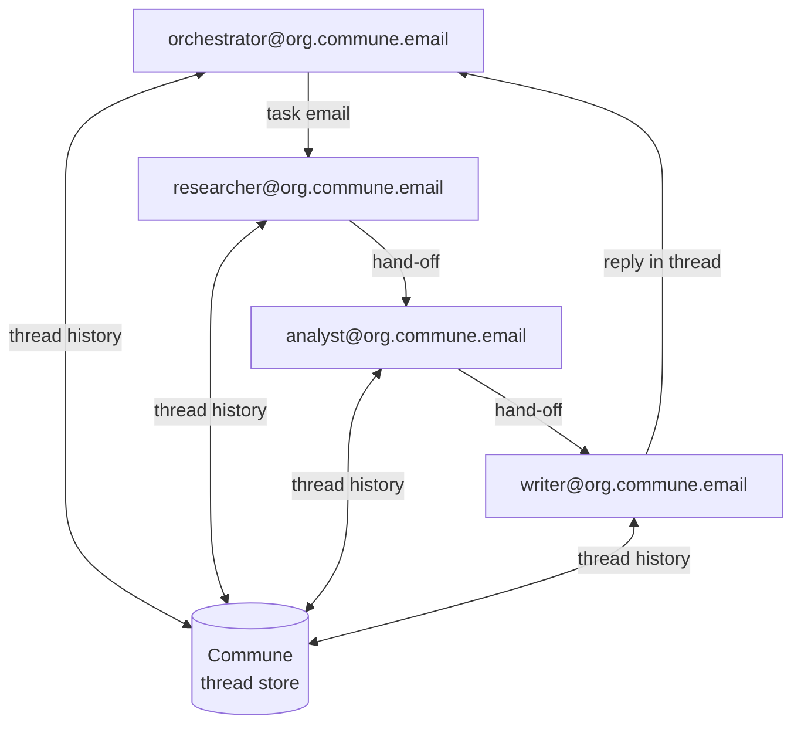

# Agent-to-Agent Communication

> Email gives every agent a permanent address. Agents discover each other. They send tasks, receive results, and maintain context — without shared memory, without a coordination database, without a supervisor process.

---

## The Primitive

```python
# Every agent is an address
orchestrator = commune.inboxes.create(local_part="orchestrator")
researcher   = commune.inboxes.create(local_part="researcher")

# orchestrator@org.commune.email → researcher@org.commune.email
task = commune.messages.send(
    to=researcher.address,
    subject="Research task",
    text="Compare pricing for Postgres hosting providers.",
    inbox_id=orchestrator.id,
)

# researcher processes and replies in the same thread
commune.messages.send(
    to=orchestrator.address,
    subject="Re: Research task",
    text=result,
    inbox_id=researcher.id,
    thread_id=task.thread_id,   # same thread = full task context preserved
)

# orchestrator reads the full chain
messages = commune.threads.messages(task.thread_id)
# messages[0] = original task
# messages[1] = researcher's result
# This thread survives process restarts, retries, and time
```

---

## Why This Works

Email is a neutral, async, durable transport. It has no opinion about which LLM you run, which framework you use, or whether your agents are on the same host. The thread ID is the task context. The inbox address is the agent identity.

**What Commune adds on top of raw SMTP:**

| Primitive | Why agents need it |
|-----------|-------------------|
| `thread_id` carry-through | Full task chain preserved across restarts and retries |
| Per-inbox extraction schema | Incoming tasks auto-parsed to typed fields — no JSON marshalling in agent code |
| Semantic search across threads | Worker finds relevant past tasks before starting duplicate work |
| Idempotency key on `messages.send` | Orchestrator can retry safely — exactly one task email delivered |
| HMAC-signed webhooks | Worker verifies the task came from a known orchestrator address |

---

## Typed Task Delegation

Configure a schema on the worker's inbox once. Commune parses every incoming task email automatically — before your webhook fires.

```python
# One-time setup: define what a "research task" looks like
commune.inboxes.update(researcher.id, extraction_schema={
    "type": "object",
    "required": ["query", "format"],
    "properties": {
        "query":    {"type": "string"},
        "format":   {"type": "string", "enum": ["bullet_points", "prose", "json"]},
        "max_words": {"type": "integer"},
    }
})

# Orchestrator sends a plain-English email
commune.messages.send(
    to=researcher.address,
    subject="Research task",
    text="Please research Postgres hosting providers. Format: bullet_points. Max 200 words.",
    inbox_id=orchestrator.id,
    idempotency_key=f"research-{task_id}",
)

# Worker's webhook receives already-parsed fields — no parsing logic needed
# payload["extracted"] → {"query": "Postgres hosting", "format": "bullet_points", "max_words": 200}
```

No JSON encoding in the task email. No schema negotiation between agents. Commune's extraction layer handles the protocol.

---

## Full Working Example

**→ [`orchestrator.py`](orchestrator.py)** — Creates worker inbox, sends typed task, polls for result, reads full thread.

**→ [`worker.py`](worker.py)** — Webhook handler: receives task, checks past work via semantic search, runs agent, replies in thread.

```
orchestrator.py                          worker.py
──────────────                          ─────────
1. provision researcher inbox      
2. configure task schema           
3. send task email                →   4. webhook fires (task already parsed)
                                       5. semantic search for past similar tasks
                                       6. run LLM with task + past context
7. poll thread for reply          ←   8. reply in same thread (thread_id)
9. read full chain via thread_id
```

---

## Agent Mesh

Scale this to N agents. Each agent has one inbox, one address, one thread history. No shared state.

```python
# Provision the mesh (run once)
agents = {}
for role in ["orchestrator", "researcher", "analyst", "writer"]:
    inbox = commune.inboxes.create(local_part=role)
    agents[role] = inbox

# orchestrator → researcher (delegation)
t1 = commune.messages.send(
    to=agents["researcher"].address,
    subject="Research: AI chip market",
    text="...",
    inbox_id=agents["orchestrator"].id,
    idempotency_key="chip-research-2026-03",
)

# researcher → analyst (hand-off within same task chain)
commune.messages.send(
    to=agents["analyst"].address,
    subject="Analyze: AI chip research",
    text=research_result,
    inbox_id=agents["researcher"].id,
    idempotency_key="chip-analysis-2026-03",
)

# analyst → writer (next stage)
# writer → orchestrator (final result, in original thread)
```



Each node is a real email address. Each edge is a real email thread. The `thread_id` traces the full provenance chain.

---

## Patterns

### Discovery by convention
Agents find each other via predictable addresses: `researcher@org.commune.email`, `analyst@org.commune.email`. No registry needed — the address IS the capability declaration.

### Persistent task state
The thread survives process restarts. An agent that crashes mid-task can `GET /v1/threads/:id/messages` on startup to see what it was working on and whether a result has already been sent.

### Task deduplication
Before starting work, query `commune.search.threads(query=task_description)`. If a semantically similar task is already `closed` in this agent's history, return the cached result. The vector index is the task cache.

### Sub-agent provisioning
Orchestrators can spawn and provision new worker inboxes at runtime — including configuring the extraction schema specific to that worker's task type. Tear-down: archive the inbox when the task is complete.

---

## Related

- [CrewAI multi-agent example](../crewai/) — role-based crews over shared Commune inboxes
- [TypeScript multi-agent](../typescript/) — typed payloads with `commune-ai`
- [Webhook delivery capability](../capabilities/webhooks/) — how Commune delivers tasks to your workers
- [Structured extraction capability](../capabilities/extraction/) — per-inbox task schemas in depth
