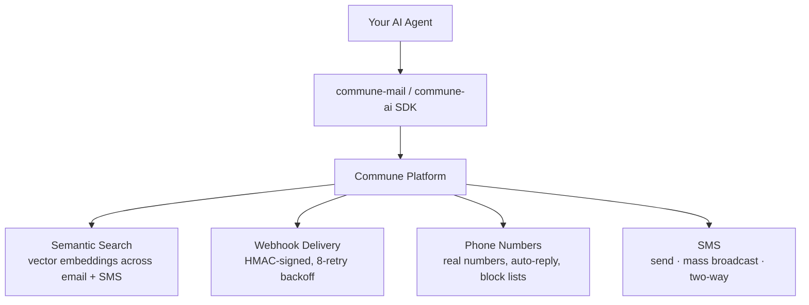

# Capabilities — Every Commune Feature with Examples

Reference implementation for every Commune feature. Start with Quickstart, then explore the capabilities you need.

## All capabilities

| Capability | Description | Files |
|-----------|-------------|-------|
| [Quickstart](quickstart/) | Get an email + phone in 60 seconds | 5 minimal examples |
| [Email Threading](email-threading/) | Keep replies in the same email chain | 2 examples (Python + TypeScript) |
| [Structured Extraction](structured-extraction/) | JSON schema extraction on inbound emails | 3 schemas + 2 examples |
| [Semantic Search](semantic-search/) | Natural language search across threads | 2 examples |
| [Webhook Delivery](webhook-delivery/) | Real-time inbound email handling | Setup + handler |
| [Phone Numbers](phone-numbers/) | Manage phone numbers programmatically | 2 examples |
| [SMS](sms/) | Quickstart, mass SMS, two-way SMS | 3 sub-examples |

---

## Start here

Recommended path through the capabilities:

```
quickstart/ → email-threading/ → structured-extraction/ → webhook-delivery/
```

1. **[quickstart/](quickstart/)** — provision an inbox and phone number, send your first message. Five minimal examples covering Python and TypeScript. Takes under 60 seconds.

2. **[email-threading/](email-threading/)** — once you have an inbox, learn how to keep replies in the correct thread. Covers `In-Reply-To` / `References` headers (RFC 5322) and the `thread_id` pattern.

3. **[structured-extraction/](structured-extraction/)** — attach a JSON schema to an inbox so every inbound email is parsed automatically. No extra LLM calls required. Includes three ready-made schemas (support ticket, order confirmation, lead form).

4. **[webhook-delivery/](webhook-delivery/)** — receive emails in real time via HMAC-signed webhooks with 8-retry guaranteed delivery. Includes a reference handler and setup guide.

After those four, explore based on what you need:

- **[semantic-search/](semantic-search/)** — natural language search across your agent's entire inbox history using vector embeddings.
- **[phone-numbers/](phone-numbers/)** — provision and manage real phone numbers programmatically.
- **[sms/](sms/)** — send, receive, and broadcast SMS from a real phone number.

---

## Quick orientation



---

## Getting started

Install the SDK:

```bash
# Python
pip install commune-mail

# TypeScript / Node
npm install commune-ai
```

Get your API key at [commune.email](https://commune.email) — free tier, no credit card required.

---

## See also

- [Framework examples](../) — LangChain, CrewAI, OpenAI Agents, Claude, MCP
- [Use cases](../use-cases/) — end-to-end workflows built on these capabilities
