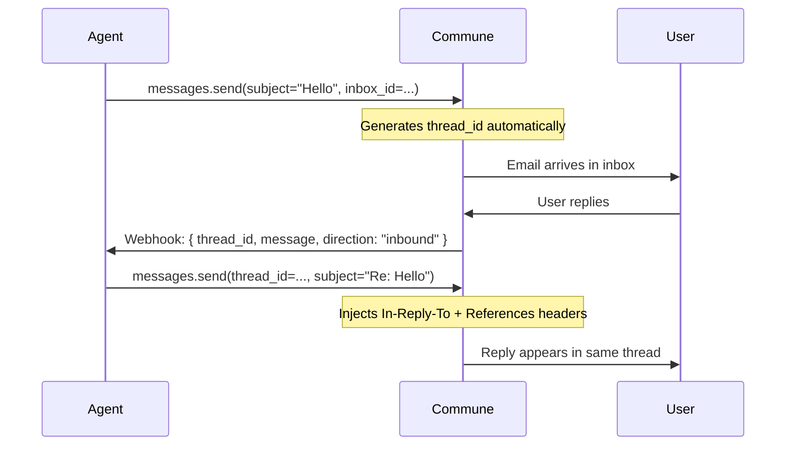

# Email Threading — Keep Conversations in One Thread

Email threading is what makes agent-to-human conversations work. Without `thread_id`, every message from your agent arrives as a new email chain. With it, your agent's replies appear inline in the user's inbox — the same way a human colleague's replies do.



---

## The pattern

```python
# First message — starts a new thread
result = commune.messages.send(
    to="user@example.com",
    subject="Hello",
    text="Hi there! Happy to help.",
    inbox_id=inbox_id,
)
# result.thread_id is generated automatically — save it

# All replies — pass the same thread_id
commune.messages.send(
    to="user@example.com",
    subject="Re: Hello",
    text="Following up — did you get a chance to review?",
    inbox_id=inbox_id,
    thread_id=result.thread_id,  # ← this is all it takes
)
```

```typescript
// TypeScript
const result = await commune.messages.send({
  to: 'user@example.com',
  subject: 'Hello',
  text: 'Hi there! Happy to help.',
  inboxId: inboxId,
});

await commune.messages.send({
  to: 'user@example.com',
  subject: 'Re: Hello',
  text: 'Following up — did you get a chance to review?',
  inboxId: inboxId,
  thread_id: result.thread_id,
});
```

---

## How it works under the hood

When you pass `thread_id` to `messages.send()`, Commune automatically injects the correct RFC 5322 email headers:

- `In-Reply-To: <original-message-id@commune.email>` — tells email clients this message is a reply
- `References: <original-message-id@commune.email>` — the full reference chain for threading

Email clients (Gmail, Outlook, Apple Mail) use these headers to group messages into a single conversation view. You don't touch headers directly — Commune handles it.

---

## Reading a full thread

```python
# Get all messages in a thread, in order
messages = commune.threads.messages(thread_id)

for msg in messages:
    direction = "→" if msg.direction == "outbound" else "←"
    print(f"{direction} [{msg.created_at}] {msg.content[:80]}")
```

---

## The Thread object

```python
threads = commune.threads.list(inbox_id=inbox_id, limit=20)
for thread in threads.data:
    print(thread.thread_id)        # "thrd_..."
    print(thread.subject)          # "Re: Your support request"
    print(thread.last_direction)   # "inbound" or "outbound"
    print(thread.message_count)    # number of messages in thread
```

```typescript
const { data: threads } = await commune.threads.list({ inbox_id, limit: 20 });
for (const thread of threads) {
  console.log(thread.thread_id);
  console.log(thread.subject);
  console.log(thread.last_direction);  // "inbound" | "outbound"
  console.log(thread.message_count);
}
```

---

## Closing a thread

When a conversation is resolved, mark the thread closed so it doesn't appear in active queues:

```typescript
await commune.threads.setStatus(threadId, 'closed');
```

---

## Common patterns

**Replying to an inbound webhook:**

```python
@app.route("/email-webhook", methods=["POST"])
def handle_email():
    data = request.json
    thread_id = data["message"]["thread_id"]
    user_email = data["message"]["participants"][0]["identity"]

    reply = generate_reply(data["message"]["content"])

    commune.messages.send(
        to=user_email,
        subject="Re: " + data["message"]["subject"],
        text=reply,
        inbox_id=INBOX_ID,
        thread_id=thread_id,  # ← stays in the same thread
    )
    return {"status": "ok"}
```

**Multi-turn agent loop:**

```python
# Start a conversation
result = commune.messages.send(to=user, subject="Onboarding", text="Step 1...", inbox_id=inbox_id)
thread_id = result.thread_id

# Later — agent sends step 2 in the same thread
commune.messages.send(to=user, subject="Re: Onboarding", text="Step 2...", inbox_id=inbox_id, thread_id=thread_id)

# Later — agent sends step 3
commune.messages.send(to=user, subject="Re: Onboarding", text="Step 3...", inbox_id=inbox_id, thread_id=thread_id)
```

---

## Files

| File | Description |
|------|-------------|
| `threading-example.py` | Full send-detect-reply cycle in Python |
| `threading-example.ts` | Same pattern in TypeScript |
