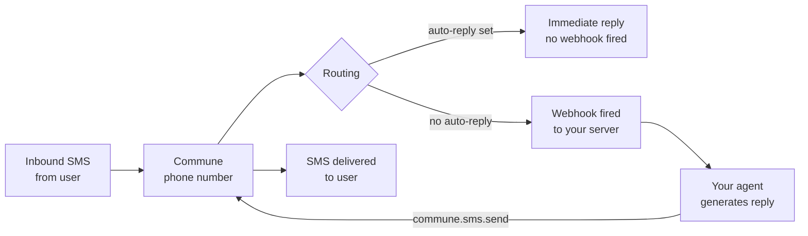

# Phone Numbers — Give Your Agent a Real Phone Number

Provision a real phone number for your AI agent. Send SMS, receive texts via webhook, set auto-replies, and manage block/allow lists — all via API.

```python
# List your phone numbers
numbers = commune.phone_numbers.list()
for n in numbers:
    print(f"{n.number} — SMS: {n.capabilities.sms}")

# Send an SMS
commune.sms.send(
    to="+14155551234",
    body="Hello from your agent!",
    phone_number_id=numbers[0].id,
)
```

---

## Provisioning a number

New numbers are provisioned via the Commune dashboard or the TypeScript `phoneNumbers.available()` + `phoneNumbers.provision()` methods.

```typescript
import { CommuneClient } from 'commune-ai';
const commune = new CommuneClient({ apiKey: process.env.COMMUNE_API_KEY! });

// Search for available numbers in a specific area code
const available = await commune.phoneNumbers.available({
  type: 'Local',
  area_code: '415',
});

for (const n of available) {
  console.log(`${n.phoneNumber} — SMS: ${n.capabilities.sms}, Voice: ${n.capabilities.voice}`);
}

// Provision the first available number
const provisioned = await commune.phoneNumbers.provision(available[0].phoneNumber);
console.log(`Provisioned: ${provisioned.number} (id: ${provisioned.id})`);
```

---

## Number capabilities

Each number object carries a `capabilities` field:

| Field | Type | Meaning |
|-------|------|---------|
| `capabilities.sms` | boolean | Can send and receive SMS |
| `capabilities.voice` | boolean | Can make and receive calls |

Most local numbers support both. Toll-free numbers typically support SMS only.

---

## Auto-reply

Set a static auto-reply for when your agent is offline or processing. Useful as a holding message while your agent thinks:

```typescript
await commune.phoneNumbers.update(phoneNumberId, {
  friendlyName: 'Support Line',
  autoReply: 'Thanks for your message! Our agent will get back to you within 1 hour.',
});
```

Remove an auto-reply by setting it to an empty string:

```typescript
await commune.phoneNumbers.update(phoneNumberId, { autoReply: '' });
```

---

## Webhook configuration

Configure which events get delivered to your server:

```typescript
await commune.phoneNumbers.setWebhook(phoneNumberId, {
  endpoint: 'https://your-app.railway.app/sms-webhook',
  events: ['sms.received'],
});
```

SMS webhooks use URL-encoded bodies (Twilio-compatible format) with fields `From`, `To`, `Body`, and `MessageSid`. See [SMS Two-Way](../sms/two-way/) for a complete handler.

---

## Architecture



---

## Files

| File | Description |
|------|-------------|
| [`manage-numbers.py`](manage-numbers.py) | Python — list numbers, send SMS, read conversations |
| [`manage-numbers.ts`](manage-numbers.ts) | TypeScript — full API: list, provision, setWebhook, update, available |

---

## Related

- [SMS Quickstart](../sms/quickstart/) — send your first SMS in under 2 minutes
- [SMS Two-Way](../sms/two-way/) — receive inbound SMS via webhook and reply with your agent
- [SMS Mass Broadcast](../sms/mass-sms/) — send to many recipients with rate limiting
