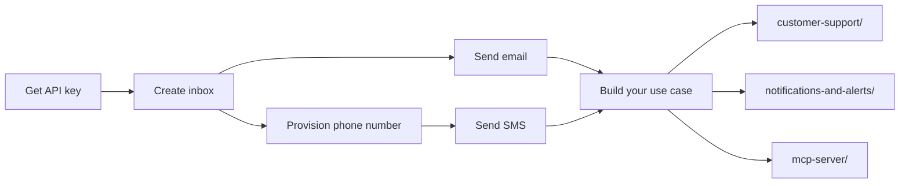

# Quickstart — Give Your Agent an Email Address & Phone Number

```python
# Install
pip install commune-mail

# Give your agent an email address in 3 lines
from commune import CommuneClient
commune = CommuneClient(api_key="comm_...")
inbox = commune.inboxes.create(local_part="my-agent")
print(inbox.address)  # → my-agent@yourdomain.commune.email
```

```typescript
// TypeScript
// npm install commune-ai
import { CommuneClient } from 'commune-ai';
const commune = new CommuneClient({ apiKey: 'comm_...' });
const inbox = await commune.inboxes.create({ localPart: 'my-agent' });
console.log(inbox.address); // → my-agent@yourdomain.commune.email
```

That's it. Your agent has an inbox. Get your API key at [commune.email](https://commune.email).

---

## What can your agent do with this inbox?

- **Send emails** — outbound messages from your agent's address, with thread awareness
- **Receive emails** — Commune delivers inbound mail to your webhook endpoint in real time
- **Search past threads** — retrieve any conversation by thread ID, list all threads in an inbox
- **Extract structured data** — configure a JSON schema once; Commune populates it from every inbound email automatically, before your webhook fires
- **Get delivery metrics** — sent, delivered, bounced, opened — available per message

---

## Send your first email

```python
result = commune.messages.send(
    to="you@example.com",
    subject="Hello from my agent",
    text="This email was sent by an AI agent using Commune.",
    inbox_id=inbox.id,
)
print(result.thread_id)  # save this for replies
```

```typescript
const result = await commune.messages.send({
  to: 'you@example.com',
  subject: 'Hello from my agent',
  text: 'This email was sent by an AI agent using Commune.',
  inboxId: inbox.id,
});
console.log(result.thread_id);
```

---

## Give your agent a phone number

```python
# List your provisioned numbers
numbers = commune.phone_numbers.list()
print(numbers[0].number)  # → +14155551234

# Send an SMS
commune.sms.send(
    to="+14155550000",
    body="Hello from your agent!",
    phone_number_id=numbers[0].id,
)
```

```typescript
const numbers = await commune.phoneNumbers.list();
await commune.sms.send({
  to: '+14155550000',
  body: 'Hello from your agent!',
  phone_number_id: numbers[0].id,
});
```

Provision a new number at [commune.email/dashboard](https://commune.email/dashboard).

---

## Files in this directory

| File | What it does |
|------|-------------|
| `give-your-agent-email.py` | Create inbox, print address, send test email |
| `give-your-agent-phone-number.py` | List phone numbers, send test SMS |
| `send-your-first-email.py` | Minimal example: create inbox → send email |
| `send-your-first-sms.py` | Minimal example: list phones → send SMS |
| `setup.py` | Full onboarding: inbox + test email + phone + test SMS |

---

## Next steps

Once you have an inbox and phone number, you're ready for the real use cases:

- **[use-cases/customer-support/](../../use-cases/customer-support/)** — email + SMS support agent with knowledge base and thread-aware replies
- **[use-cases/notifications-and-alerts/](../../use-cases/notifications-and-alerts/)** — incident alerting with SMS escalation and email acknowledgment
- **[mcp-server/](../../mcp-server/)** — give Claude Desktop or any MCP client a live email inbox
- **[capabilities/email-threading/](../email-threading/)** — keep all replies in one thread
- **[capabilities/structured-extraction/](../structured-extraction/)** — auto-parse inbound emails into JSON


