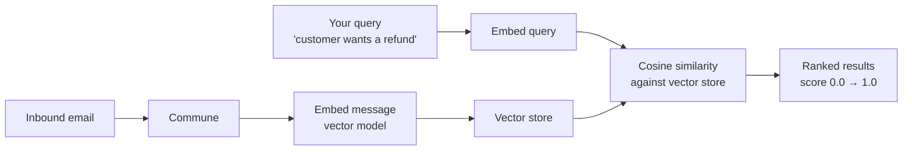

# Semantic Search — Find Emails with Natural Language

Search your email threads with plain English. Commune uses vector embeddings to find semantically similar conversations — not just keyword matching.

```python
# Find emails about billing issues — even if they don't say "billing"
results = commune.search.threads(
    query="customer wants a refund",
    inbox_id=inbox_id,
    limit=5
)
for r in results:
    print(f"{r.subject} (score: {r.score:.2f})")
```

---

## How it works

Every message is embedded at ingest time using a vector model. When you search, your query is embedded with the same model and compared against stored thread embeddings using cosine similarity. Results are ranked by semantic closeness — not by whether the words literally match.



This means:

- `"billing refund"` matches `"charge dispute"`, `"cost too high"`, `"money back"` — even with zero keyword overlap
- `"login problems"` matches `"can't sign in"`, `"forgot password"`, `"authentication error"`
- `"shipping delay"` matches `"package hasn't arrived"`, `"where is my order"`, `"late delivery"`

---

## The score field

Results include a relevance `score` between `0.0` and `1.0`. Higher is more semantically similar to your query.

```python
results = commune.search.threads(query="refund request", inbox_id=inbox_id, limit=5)

for r in results:
    print(f"[{r.score:.2f}] {r.subject}")
    # [0.94] Customer upset about double charge
    # [0.87] Please reverse my payment
    # [0.81] Billing question re: last month
    # [0.63] General account inquiry
    # [0.51] Product feedback — nice app btw
```

A practical threshold: results above `0.75` are usually strong matches. Below `0.5` is typically noise.

---

## Real use cases

**Agent context retrieval** — before your agent replies to a support email, search for similar past threads to inform the response:

```python
# Before drafting a reply, find similar past conversations
context = commune.search.threads(
    query=inbound_message.text,
    inbox_id=inbox_id,
    limit=3,
)
# Pass context into the LLM prompt
```

**Deduplication** — detect whether a new issue was already reported:

```python
similar = commune.search.threads(query=new_issue_description, inbox_id=inbox_id, limit=1)
if similar and similar[0].score > 0.85:
    # Likely a duplicate — link to existing thread
    existing_thread_id = similar[0].thread_id
```

**Topic routing** — classify and route inbound tickets without a separate classifier:

```python
categories = {
    "billing":  "refund charge payment invoice subscription",
    "technical": "error bug crash not working broken",
    "feature":  "request suggestion improvement idea",
}
for category, query in categories.items():
    results = commune.search.threads(query=query, inbox_id=inbox_id, limit=1)
    if results and results[0].score > 0.75:
        route_to(category, results[0].thread_id)
        break
```

---

## Cross-channel search

The search API works across both email and SMS threads. One query surfaces relevant context regardless of channel — useful when a customer switches from email to text mid-conversation.

```python
# Returns both email threads and SMS conversations
results = commune.search.threads(
    query="appointment rescheduling",
    inbox_id=inbox_id,
    limit=10,
)
```

---

## TypeScript

```typescript
import { CommuneClient } from 'commune-ai';
const commune = new CommuneClient({ apiKey: process.env.COMMUNE_API_KEY! });

const results = await commune.search.threads({
    query: 'customer wants a refund',
    inboxId: inboxId,
    limit: 5,
});

for (const r of results) {
    console.log(`[${r.score.toFixed(2)}] ${r.subject} — participants: ${r.participants.join(', ')}`);
}
```

---

## Files

| File | Description |
|------|-------------|
| [`search-example.py`](search-example.py) | Python example — run multiple semantic queries against a real inbox |
| [`search-example.ts`](search-example.ts) | TypeScript equivalent |

---

## Related

- [SMS Quickstart](../sms/quickstart/) — set up SMS so search covers your text conversations too
- [Webhook Delivery](../webhook-delivery/) — trigger a search when new mail arrives
