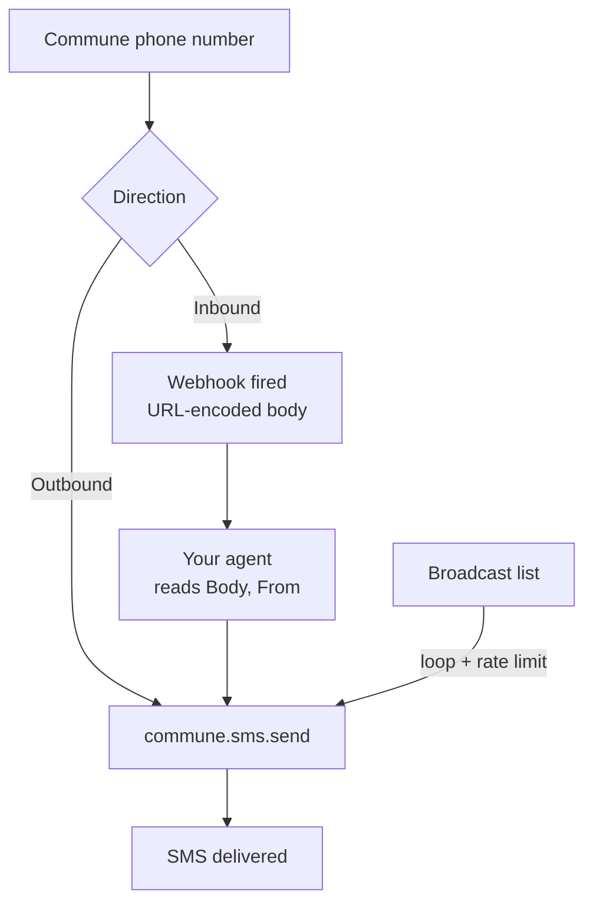

# SMS — Send, Receive, and Broadcast

Your agent can send and receive SMS from a real phone number. This section has three examples, ordered from simplest to most involved.

---

## Examples

| Example | What it shows |
|---------|---------------|
| [quickstart/](quickstart/) | Send your first SMS in under 2 minutes |
| [mass-sms/](mass-sms/) | Send personalized SMS to many recipients with rate limiting |
| [two-way/](two-way/) | Receive inbound SMS via webhook and reply with an AI agent |

---

## How it fits together



---

## Prerequisites

All SMS examples need a provisioned phone number. Get one via the Commune dashboard or:

```typescript
// TypeScript — search and provision
const available = await commune.phoneNumbers.available({ type: 'Local', area_code: '415' });
await commune.phoneNumbers.provision(available[0].phoneNumber);
```

Then set your key:

```bash
export COMMUNE_API_KEY=comm_...
```

---

## See also

- [Phone Numbers](../phone-numbers/) — manage numbers, set auto-reply, configure webhooks
- [Semantic Search](../semantic-search/) — search across SMS and email threads together
