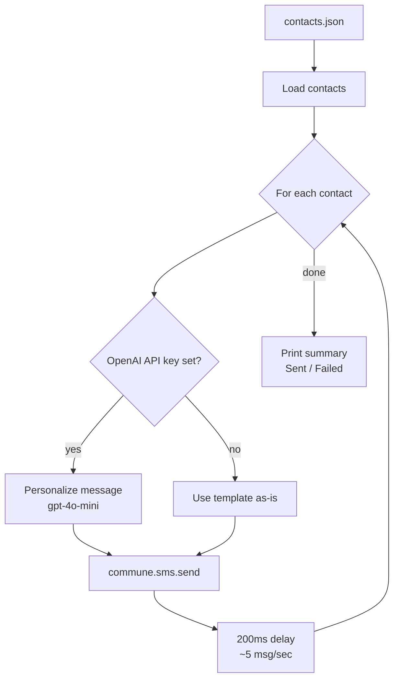

# Mass SMS — Send to Many Recipients

Send personalized SMS to a contact list. Includes rate limiting, per-contact personalization via OpenAI, and a summary of sent vs failed.

---

## How it works



---

## Usage

```bash
pip install commune-mail openai

export COMMUNE_API_KEY=comm_...
export OPENAI_API_KEY=sk_...   # optional — skip for plain template sends

python broadcast.py --message "Your order has shipped!" --contacts contacts.json
```

Output:

```
Sending to 5 contacts...

  +14155551001 — Your order has shipped, Sarah!
  +14155551002 — Hi James, just letting you know your order is on its way.
  +14155551003 — Your order has shipped!
  ...

Sent: 5 | Failed: 0
```

---

## Rate limiting

Carriers throttle senders that burst too fast. The broadcaster enforces a 200ms delay between sends (~5 messages/second). For large lists (1000+), consider batching over multiple hours and checking suppression lists first:

```python
# Check who has opted out before sending
suppressions = commune.sms.suppressions(phone_number_id=phone_id)
opted_out = {s.phone_number for s in suppressions}
contacts = [c for c in contacts if c["phone"] not in opted_out]
```

---

## Suppression / opt-out

If a recipient replies `STOP`, Commune adds them to the suppression list automatically. Re-add them only if they explicitly opt back in:

```python
commune.sms.remove_suppression("+14155551234")
```

---

## Files

| File | Description |
|------|-------------|
| [`broadcast.py`](broadcast.py) | Broadcaster with optional OpenAI personalization |
| [`contacts.json`](contacts.json) | Sample contact list |

---

## Related

- [SMS Quickstart](../quickstart/) — send a single SMS first
- [Phone Numbers](../../phone-numbers/) — manage numbers and check capabilities
