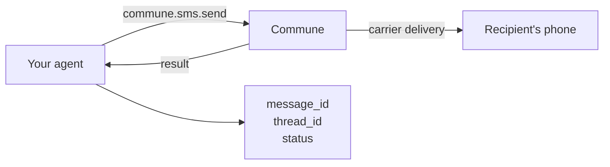

# SMS Quickstart — Send Your First SMS

**Python:**

```bash
pip install commune-mail
```

```python
from commune import CommuneClient

commune = CommuneClient(api_key="comm_...")

numbers = commune.phone_numbers.list()
result = commune.sms.send(
    to="+14155551234",              # replace with your number
    body="Hello from my AI agent!",
    phone_number_id=numbers[0].id,
)
print(f"Sent! Message ID: {result.message_id}")
```

**TypeScript:**

```bash
npm install commune-ai
```

```typescript
import { CommuneClient } from 'commune-ai';

const commune = new CommuneClient({ apiKey: 'comm_...' });

const numbers = await commune.phoneNumbers.list();
const result = await commune.sms.send({
    to: '+14155551234',             // replace with your number
    body: 'Hello from my AI agent!',
    phone_number_id: numbers[0].id,
});
console.log(`Sent! Message ID: ${result.message_id}`);
```

---

## What you get back

```python
result.message_id      # "msg_abc123"
result.thread_id       # "thd_xyz789" — stable ID for this conversation
result.status          # "queued" | "sent" | "delivered" | "failed"
result.credits_charged # 1  (1 credit per 160-char SMS segment)
```

---

## Flow



---

## No phone numbers?

Provision one in the [Commune dashboard](https://commune.email/dashboard) or see [Phone Numbers](../../phone-numbers/) for the full API.

---

## What's next?

- [Mass SMS](../mass-sms/) — send to many recipients with personalization and rate limiting
- [Two-Way SMS](../two-way/) — receive inbound SMS via webhook and reply with your agent

---

## Files

| File | Description |
|------|-------------|
| [`send-first-sms.py`](send-first-sms.py) | Python — 15 lines, just works |
| [`send-first-sms.ts`](send-first-sms.ts) | TypeScript equivalent |
