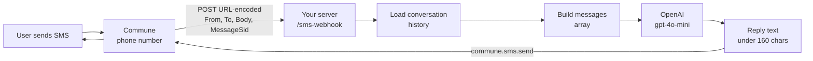

# Two-Way SMS — Receive and Reply to SMS Messages

Provision a phone number, point it at a webhook, and your agent handles every inbound text — reading conversation history, generating a reply with OpenAI, and sending it back.

---

## How it works



**Webhook format:** Commune sends inbound SMS as URL-encoded POST bodies (Twilio-compatible):

| Field | Example | Meaning |
|-------|---------|---------|
| `From` | `+14155551234` | Sender's number |
| `To` | `+14155557890` | Your Commune number |
| `Body` | `What time does my appointment start?` | Message text |
| `MessageSid` | `SM_abc123` | Unique message ID |

---

## Setup

**1. Configure webhook on your phone number** (once):

```typescript
await commune.phoneNumbers.setWebhook(phoneNumberId, {
  endpoint: 'https://your-app.railway.app/sms-webhook',
  events: ['sms.received'],
});
```

Or set `COMMUNE_PHONE_NUMBER_ID` in your `.env` and the server auto-configures on startup.

**2. Fill in `.env`** (copy from `.env.example`):

```bash
COMMUNE_API_KEY=comm_...
COMMUNE_PHONE_NUMBER_ID=pn_...
OPENAI_API_KEY=sk_...
```

**3. Install and run:**

```bash
npm install
npm run dev
```

**4. Send a text to your Commune number.** The agent will reply.

---

## Conversation history

Every inbound message triggers a load of the full conversation history before the LLM call:

```typescript
const history = await commune.sms.thread(from, phoneNumberId);
// history: SmsMessage[] sorted oldest → newest
// Each message: { direction: 'inbound' | 'outbound', content, created_at }
```

This gives the agent full context — it knows what was said before and can maintain continuity across sessions without a separate database.

---

## Files

| File | Description |
|------|-------------|
| [`src/index.ts`](src/index.ts) | Express webhook handler — parse, load history, reply |
| [`package.json`](package.json) | Dependencies |
| [`.env.example`](.env.example) | Required environment variables |

---

## Related

- [SMS Quickstart](../quickstart/) — send your first SMS first
- [Phone Numbers](../../phone-numbers/) — provision a number and configure auto-reply
- [Webhook Delivery](../../webhook-delivery/) — same pattern for email webhooks
