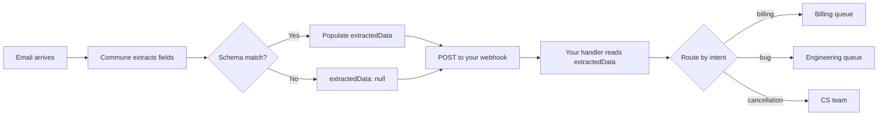

# Structured Extraction — Auto-Parse Every Inbound Email

Commune extracts structured JSON from every inbound email automatically — before your webhook fires. No extra LLM call. No regex. Just a JSON schema.

Configure once. Every email that arrives in the inbox gets parsed against your schema. Your webhook receives the extracted fields alongside the raw message.



---

## Configure a schema

Tell Commune what to extract from every email in an inbox. Uses the REST API directly (call this once, at setup time):

```python
import os, requests

COMMUNE_API_KEY = os.environ["COMMUNE_API_KEY"]
DOMAIN_ID = os.environ["COMMUNE_DOMAIN_ID"]
INBOX_ID = os.environ["COMMUNE_INBOX_ID"]

requests.put(
    f"https://api.commune.email/v1/domains/{DOMAIN_ID}/inboxes/{INBOX_ID}/extraction-schema",
    headers={"Authorization": f"Bearer {COMMUNE_API_KEY}"},
    json={
        "name": "support_ticket",
        "enabled": True,
        "schema": {
            "type": "object",
            "properties": {
                "intent": {
                    "type": "string",
                    "enum": ["billing", "bug", "feature_request", "cancellation", "question"]
                },
                "urgency": {
                    "type": "string",
                    "enum": ["low", "medium", "high"]
                },
                "order_number": {"type": "string"},
            }
        }
    }
)
```

---

## What your webhook receives

After configuring a schema, every inbound email webhook payload includes `extractedData`:

```json
{
  "message": {
    "direction": "inbound",
    "content": "Hi, I need help with order ORD-12345. My card was charged twice...",
    "thread_id": "thrd_...",
    "participants": [{"role": "sender", "identity": "user@example.com"}]
  },
  "extractedData": {
    "intent": "billing",
    "urgency": "high",
    "order_number": "ORD-12345"
  }
}
```

If a field can't be determined from the email, it's omitted or null. The raw email is always there in `message.content`.

---

## Read extracted data and route

```python
@app.route("/email-webhook", methods=["POST"])
def handle_email():
    data = request.json
    extracted = data.get("extractedData") or {}

    intent = extracted.get("intent", "question")
    urgency = extracted.get("urgency", "low")
    order_number = extracted.get("order_number")

    if intent == "billing" and urgency == "high":
        route_to_billing_team(data, order_number)
    elif intent == "bug":
        create_jira_ticket(data)
    elif intent == "cancellation":
        trigger_save_flow(data)
    else:
        route_to_general_queue(data)

    return {"status": "ok"}
```

---

## Three example schemas

### Support tickets

Extracts intent, urgency, and order number from customer support emails.

See [schemas/support-ticket.json](./schemas/support-ticket.json)

### Invoices

Extracts vendor, amount, due date, and line items from inbound invoices.

See [schemas/invoice.json](./schemas/invoice.json)

### Job applications

Extracts candidate name, role, years of experience, and skills from inbound applications.

See [schemas/job-application.json](./schemas/job-application.json)

---

## Files

| File | Description |
|------|-------------|
| `setup-schema.py` | Configure an extraction schema on an inbox |
| `extraction-example.py` | Flask webhook handler — reads `extractedData` and routes |
| `schemas/support-ticket.json` | Support ticket extraction schema |
| `schemas/invoice.json` | Invoice extraction schema |
| `schemas/job-application.json` | Job application extraction schema |

---

## Tips

- **Enable only what you need.** Extraction runs on every inbound email — keep schemas focused on the fields you'll actually use.
- **Use enums for classification fields.** `intent`, `urgency`, `status` — constrained values give you reliable routing.
- **Free-text fields are fine too.** `summary`, `error_message`, `requested_feature` — Commune will extract these verbatim from the email.
- **Extraction is not guaranteed.** If the email doesn't contain the requested field, Commune omits it rather than guessing. Always handle missing fields gracefully.
