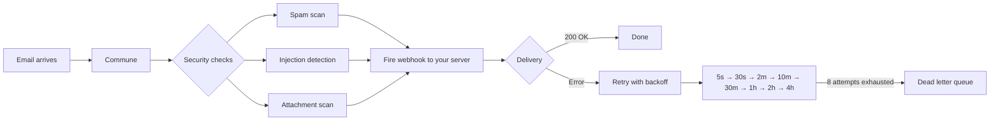

# Webhook Delivery — Receive Emails in Real Time

Email arrives, Commune processes it, and fires an HMAC-signed webhook to your server — so your agent reacts to every inbound message without polling.

```
email arrives → Commune (spam check, injection detection, attachment scan) → HMAC-signed webhook → your server
```

---

## How delivery works



**Reliability guarantees:**

- 8 retry attempts with exponential backoff (5s → 30s → 2m → 10m → 30m → 1h → 2h → 4h)
- Circuit breaker opens after 5 consecutive failures — protects your server from thundering herd on recovery
- Every webhook payload is HMAC-SHA256 signed with your webhook secret
- Dead letter queue captures events your server never acknowledged — inspect via dashboard

---

## Setup

**1. Create an inbox and point it at your endpoint** (one-time, run `webhook-setup.ts`):

```typescript
import { CommuneClient } from 'commune-ai';
const commune = new CommuneClient({ apiKey: process.env.COMMUNE_API_KEY! });

// Create inbox
const inbox = await commune.inboxes.create({ localPart: 'support' });

// Configure webhook
const domains = await commune.domains.list();
await commune.inboxes.setWebhook(domains[0].id, inbox.id, {
  endpoint: 'https://your-app.railway.app/webhook',
  events: ['email.received'],
});
```

**2. Copy your webhook secret** from the Commune dashboard into your environment:

```bash
COMMUNE_WEBHOOK_SECRET=whsec_...
```

**3. Deploy your handler** (`webhook-handler.ts`). Respond with `200 OK` within 10 seconds or Commune will retry.

---

## Webhook payload

```jsonc
{
  "event": "email.received",
  "timestamp": 1709123456789,
  "data": {
    // The inbox that received the message
    "inbox_id": "inb_abc123",
    "inbox_address": "support@acme.commune.email",

    // Thread context
    "thread_id": "thd_xyz789",
    "is_first_message": true,       // false if this is a reply in an existing thread

    // The message itself
    "message_id": "msg_def456",
    "from": "alice@example.com",
    "to": ["support@acme.commune.email"],
    "subject": "Help with my order",
    "text": "Hi, my order ORD-123 hasn't arrived yet...",
    "html": "<p>Hi, my order ORD-123 hasn't arrived yet...</p>",
    "received_at": "2024-02-28T12:34:56.789Z",

    // Structured extraction (if you configured a schema on the inbox)
    "extracted": {
      "order_id": "ORD-123",
      "issue_type": "missing",
      "urgency": "high"
    },

    // Attachments (metadata only — fetch content separately if needed)
    "attachments": [
      {
        "filename": "screenshot.png",
        "content_type": "image/png",
        "size_bytes": 48210,
        "attachment_id": "att_ghi012"
      }
    ]
  }
}
```

---

## Signature verification

Every webhook includes two headers:

| Header | Value |
|--------|-------|
| `x-commune-signature` | `v1={HMAC-SHA256(secret, "{timestamp}.{raw_body}")}` |
| `x-commune-timestamp` | Unix timestamp in milliseconds |

Use `verifyCommuneWebhook` from `commune-ai` — it handles the HMAC check and replay-attack window (rejects timestamps older than 5 minutes):

```typescript
import { verifyCommuneWebhook } from 'commune-ai';

app.post('/webhook', express.raw({ type: 'application/json' }), (req, res) => {
  const payload = verifyCommuneWebhook({
    rawBody:   req.body,                                    // must be raw Buffer
    timestamp: req.headers['x-commune-timestamp'] as string,
    signature: req.headers['x-commune-signature'] as string,
    secret:    process.env.COMMUNE_WEBHOOK_SECRET!,
  });
  // payload is verified — process safely
  res.sendStatus(200);
});
```

> Always pass the **raw** request body to `verifyCommuneWebhook`. If you parse the body as JSON first (e.g. with `express.json()`), the byte-level signature check will fail.

---

## Respond fast, process async

Your handler must return `200 OK` within 10 seconds. For anything slower (LLM calls, database writes, sending replies), acknowledge immediately and process in the background:

```typescript
app.post('/webhook', express.raw({ type: 'application/json' }), (req, res) => {
  const payload = verifyCommuneWebhook({ ... });
  res.sendStatus(200);            // acknowledge immediately

  // Process asynchronously — do not await before responding
  handleEmailAsync(payload).catch(console.error);
});
```

---

## Files

| File | Description |
|------|-------------|
| [`webhook-setup.ts`](webhook-setup.ts) | One-time setup: create inbox and configure webhook endpoint |
| [`webhook-handler.ts`](webhook-handler.ts) | Production webhook handler with HMAC verification |
| [`package.json`](package.json) | Dependencies |
| [`.env.example`](.env.example) | Required environment variables |

---

## Related

- [Semantic Search](../semantic-search/) — search across threads surfaced by webhooks
- [SMS Two-Way](../sms/two-way/) — SMS uses a different webhook format (URL-encoded, Twilio-style)
