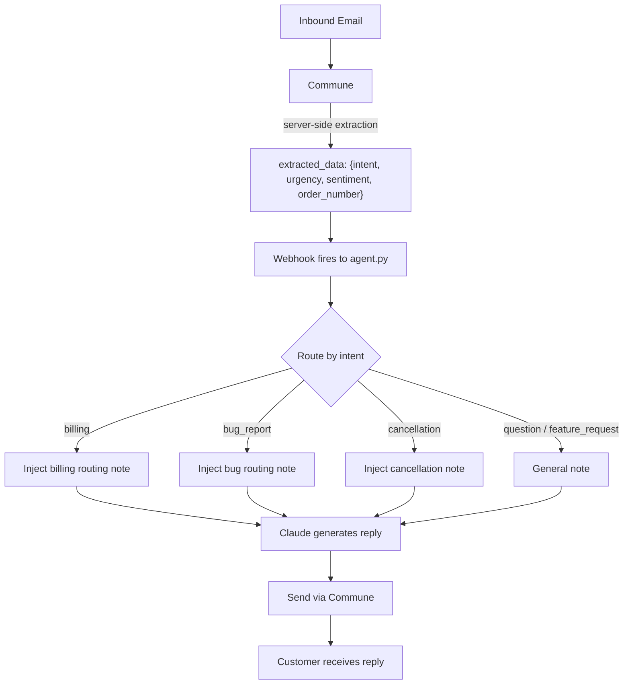

# Claude Structured Extraction Agent

An email support agent that shows what becomes possible when structured parsing happens at the infrastructure layer rather than in your agent.

**The key insight:** Commune extracts structured JSON from every inbound email automatically — before your agent even sees it. No LLM call needed for parsing. By the time the webhook fires, you already know the intent, urgency, sentiment, and any order numbers. Claude skips straight to generating a reply with full routing context already in hand.

## How the extraction works

You define a JSON schema once on the inbox:

```json
{
  "intent": "question | billing | bug_report | feature_request | cancellation",
  "urgency": "low | medium | high",
  "order_number": "string or null",
  "sentiment": "positive | neutral | negative"
}
```

Commune applies this schema to every inbound message server-side. The webhook payload Commune sends to your agent already includes `extracted_data` — a populated instance of that schema.

## Architecture



## What the webhook payload looks like

```json
{
  "event": "message.received",
  "thread_id": "thr_01abc...",
  "message": {
    "direction": "inbound",
    "content": "Hi, I was charged twice for order ORD-1234 last week..."
  },
  "extracted_data": {
    "intent": "billing",
    "urgency": "high",
    "order_number": "ORD-1234",
    "sentiment": "negative"
  }
}
```

No regex. No classification prompt. No extra LLM call. The fields are there waiting.

## Setup

**1. Install dependencies**

```bash
pip install -r requirements.txt
```

**2. Set environment variables**

```bash
cp .env.example .env
# Edit .env and fill in your keys
```

Or export directly:

```bash
export COMMUNE_API_KEY=comm_...
export ANTHROPIC_API_KEY=sk-ant-...
```

Get a Commune API key at [commune.sh](https://commune.sh).

**3. Expose your local server**

Commune needs a public URL to send webhooks to. Use [ngrok](https://ngrok.com) for local development:

```bash
ngrok http 8000
```

Copy the `https://` forwarding URL (e.g. `https://abc123.ngrok.io`).

**4. Register the webhook**

In the [Commune dashboard](https://commune.sh), open your inbox settings and set the webhook URL to:

```
https://abc123.ngrok.io/webhook
```

**5. Run the agent**

```bash
python agent.py
```

On startup the agent:
1. Registers the extraction schema on your inbox via the Commune REST API
2. Starts a Flask server on port 8000 listening for webhooks

Send a test email to your inbox address and watch the terminal output.

## Why this matters

A conventional agent would:
1. Receive the raw email text
2. Send it to an LLM to classify intent and urgency
3. Use the classification to decide what to do
4. Send it to an LLM again to generate a reply

This agent does:
1. Receive the email text **with classification already done**
2. Use the classification to decide what to do
3. Send it to an LLM to generate a reply

That is one fewer LLM round-trip per email, at zero cost for the parsing step. As volume scales, this matters both for latency and cost.

## Extraction schema

Defined in `EXTRACTION_SCHEMA` in `agent.py`. Edit it to add any fields relevant to your domain:

```python
EXTRACTION_SCHEMA = {
    "type": "object",
    "properties": {
        "intent": {
            "type": "string",
            "enum": ["question", "billing", "bug_report", "feature_request", "cancellation"],
        },
        "urgency": {
            "type": "string",
            "enum": ["low", "medium", "high"],
        },
        "order_number": {"type": ["string", "null"]},
        "sentiment": {
            "type": "string",
            "enum": ["positive", "neutral", "negative"],
        },
    },
    "required": ["intent", "urgency", "sentiment"]
}
```

## Customisation

- **Add extraction fields** — extend `EXTRACTION_SCHEMA` and update `ROUTING_NOTES` accordingly.
- **Change routing logic** — edit `get_routing_note()` to change what instructions Claude receives per intent.
- **Add tool calls** — Claude has access to `get_thread_messages`, `search_past_emails`, and `send_reply` tools if it needs to look up history before replying.
- **Change the port** — update `app.run(port=8000)` in `main()`.
