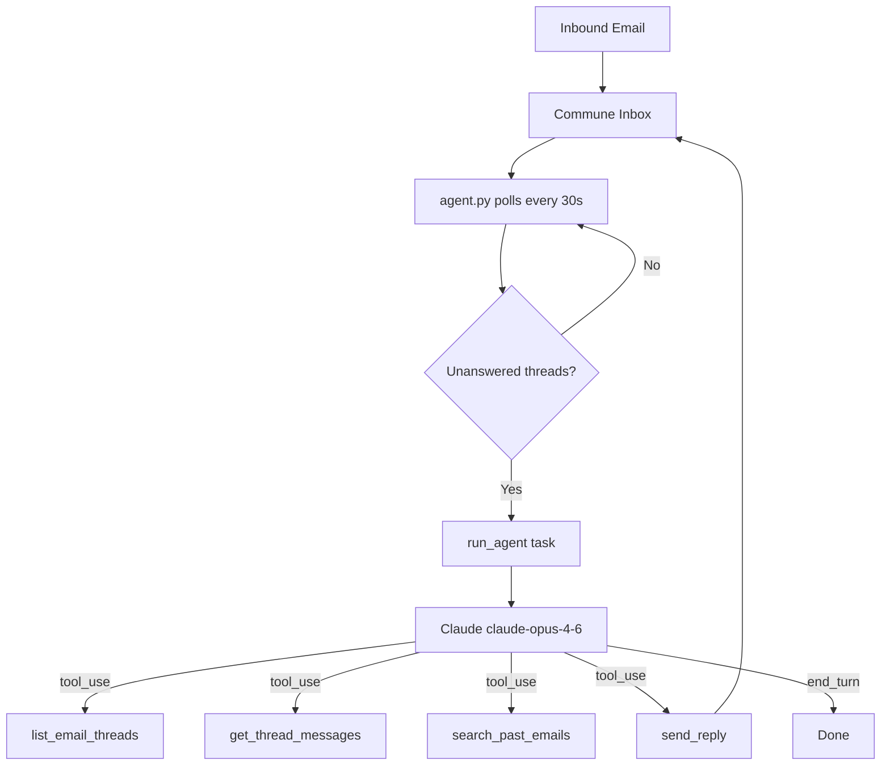

# Claude (Anthropic) — Email Support Agent

A customer support agent built with the [Anthropic Python SDK](https://github.com/anthropic/anthropic-sdk-python) and [Commune](https://commune.sh) as the email backend.

Claude's `tool_use` API handles the multi-turn agentic loop natively — no framework required. The agent polls for inbound emails, reads each conversation, optionally searches past threads for context, and sends a reply.

## Architecture



## Tools

| Tool | What it does |
|------|-------------|
| `list_email_threads` | Lists recent threads with `waiting_for_reply` flag |
| `get_thread_messages` | Reads the full message history of a thread |
| `send_reply` | Sends a reply in an existing thread (keeps conversation threaded) |
| `search_past_emails` | Semantic search across all past threads |

## Setup

**1. Install dependencies**

```bash
pip install -r requirements.txt
```

**2. Set environment variables**

```bash
cp .env.example .env
# Edit .env and fill in your keys
```

Or export directly:

```bash
export COMMUNE_API_KEY=comm_...
export ANTHROPIC_API_KEY=sk-ant-...
```

Get a Commune API key at [commune.sh](https://commune.sh).

**3. Run the agent**

```bash
python agent.py
```

The agent creates (or reuses) a `support` inbox, then polls every 30 seconds. Send a test email to your inbox address and watch it respond.

## How it works

Claude's API returns `stop_reason: "tool_use"` when it wants to call a tool, and `stop_reason: "end_turn"` when it is finished. The `run_agent` function handles this loop manually — appending assistant messages and tool results to the conversation until Claude stops:

```python
def run_agent(task: str, max_turns: int = 10) -> str:
    messages = [{"role": "user", "content": task}]

    for turn in range(max_turns):
        response = anthropic_client.messages.create(
            model="claude-opus-4-6", max_tokens=4096,
            system=SYSTEM_PROMPT, tools=TOOLS, messages=messages,
        )

        if response.stop_reason == "end_turn":
            return next((b.text for b in response.content if hasattr(b, "text")), "Done")

        # Collect tool results and continue
        messages.append({"role": "assistant", "content": response.content})
        tool_results = [execute_tool(b) for b in response.content if b.type == "tool_use"]
        messages.append({"role": "user", "content": tool_results})
```

Tools are defined as plain JSON schemas in a `TOOLS` list and executed by `execute_tool()` — a simple dispatch function that calls the appropriate Commune SDK method.

## Customisation

- **Change the inbox name** — pass a different `name` to `get_inbox()` at the top of `agent.py`.
- **Change the model** — update `model="claude-opus-4-6"` in `run_agent`.
- **Add tools** — add an entry to `TOOLS` and a matching branch in `execute_tool`.
- **Adjust polling interval** — change the `time.sleep(30)` value in `main()`.
