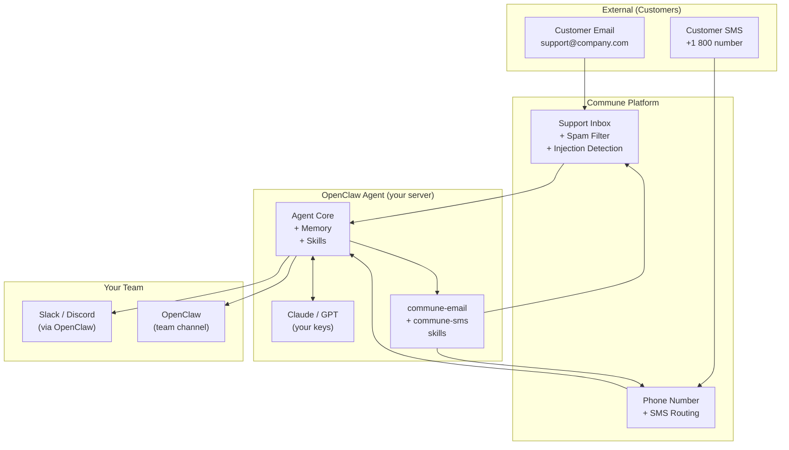

# Company AI Agent — Customer Email & SMS with Commune

**Deploy OpenClaw as your company's AI agent. It handles customer support email, sends SMS updates, and keeps your team informed — all running on your own infrastructure.**

---

## Architecture



---

## Deployment Architectures

### Pattern 1 — Triage + Respond

The agent reads all incoming emails, classifies them, responds to clear-cut cases immediately, and flags complex ones in Slack for human review.

```
Inbound email arrives
  → Agent reads it
  → Classifies: billing / bug / feature-request / cancellation / general

  If billing:    → Answer from knowledge base, close thread
  If bug:        → Acknowledge receipt, escalate to #engineering Slack
  If feature:    → Thank sender, add to backlog tag, close thread
  If cancel:     → Offer pause option, escalate if they decline
  If general:    → Draft reply, post draft in Slack for 15-min human approval window
                    → If no response in 15 min, send the draft
```

**Best for:** Teams that want AI to handle volume but retain human oversight for edge cases.

---

### Pattern 2 — Notify + Escalate

The agent monitors the inbox and acts as a triage layer — alerting humans and routing intelligently, rather than responding directly.

```
Every 15 minutes:
  → Agent checks inbox for new threads
  → Urgent (contains: "down", "can't access", "production", "breach"):
      → SMS to on-call engineer immediately
      → Post full email in #incidents Slack channel
  → Normal:
      → Post summary in #support Slack channel
      → Assign to relevant team member if identifiable

Daily at 9am:
  → Email digest to support-manager@yourco.com
  → Include: thread count, response rate, top categories, unresolved > 24h
```

**Best for:** Teams where humans want to write all replies but need better visibility and routing.

---

### Pattern 3 — Full Autonomy

The agent handles the complete support queue end-to-end. Humans only see escalations and edge cases.

```
Continuous operation:
  → New email arrives → classify → respond → close
  → New SMS arrives → acknowledge → answer or escalate
  → Any thread unanswered > 4 hours → SMS on-call, flag in Slack
  → Any thread re-opened after close → escalate immediately
  → Tone mismatch (angry customer) → route to senior support + notify manager

Weekly Monday 8am:
  → Email digest to CEO with: volume, resolution rate, top issues, CSAT trends
```

**Best for:** High-volume support where human-in-the-loop is impractical at scale.

---

## Tell Your Agent Its Role

Place this in your company agent's `SOUL.md` at `~/.openclaw/workspace/souls/support-agent/SOUL.md`:

```markdown
# Company Support Agent

I am the AI support agent for Acme Corp. I handle customer emails and SMS.

## My contact info

Email inbox: support@acme.commune.email (inbox_id: inbox_xxx)
Phone number: +18005551234 (phone_number_id: pn_xxx)

## My responsibilities

1. Read all inbound support emails every 30 minutes
2. Reply to billing questions immediately (use the pricing guide in my knowledge base)
3. For bugs: acknowledge within 1 hour, post full details to #engineering in Slack
4. For cancellations: offer a 30-day pause before confirming cancellation
5. For anything I'm unsure about: draft a reply and post it in #support for human approval
6. Send daily digest to ceo@acme.com every Monday at 9am

## Escalation triggers

Escalate via SMS to on-call (+14155559000) if:
- Subject or body contains: "breach", "hacked", "data leak", "down", "production outage"
- Customer has been waiting > 4 hours with no reply
- Customer explicitly asks to speak to a human

## Tone and style

Professional, empathetic, solution-focused. Never defensive.
Sign off as "Acme Support"
Do not use filler phrases like "I hope this email finds you well."
Be direct and clear. Customers are busy.

## What I never do

- I never promise refunds without checking the refund policy
- I never share internal system details, pricing exceptions, or other customers' information
- I never send a reply I'm not confident about — I draft it and wait for approval
```

---

## Multi-Agent Setup

OpenClaw supports multiple agents with separate workspaces and inboxes. Use this to separate concerns across inboxes.

```
~/.openclaw/workspace/
├── souls/
│   ├── support-agent/           → handles support@
│   │   ├── SOUL.md
│   │   └── AGENTS.md
│   ├── billing-agent/           → handles billing@
│   │   ├── SOUL.md
│   │   └── AGENTS.md
│   └── sales-agent/             → handles sales@
│       ├── SOUL.md
│       └── AGENTS.md
```

Each agent gets its own Commune inbox:
- `support@yourco.commune.email` → support-agent (inbox_id: inbox_aaa)
- `billing@yourco.commune.email` → billing-agent (inbox_id: inbox_bbb)
- `sales@yourco.commune.email` → sales-agent (inbox_id: inbox_ccc)

Configure in each agent's `AGENTS.md`:

```markdown
# support-agent AGENTS.md

## My Commune config
Inbox: support@yourco.commune.email
Inbox ID: inbox_aaa
Phone: +18005551234 (phone_number_id: pn_xxx)

## Routing rules
If email mentions billing/invoice/payment → forward to billing@yourco.commune.email
If email mentions a sales inquiry → forward to sales@yourco.commune.email
Otherwise → handle directly
```

The routing agent can forward by sending a new email from the correct inbox to the appropriate team inbox, or by posting a notification in the relevant Slack channel.

---

## Example Prompts — Team Commands

Your team can talk to the support agent from Slack or WhatsApp:

| Team member says | Agent does |
|-----------------|-----------|
| "How many tickets are open right now?" | Count of threads with status `open` or `needs_reply` |
| "Show me tickets that have been waiting over 24 hours" | Filter threads by `last_message_at` |
| "Reply to ticket thread_xxx and say we're investigating" | Sends reply with `thread_id` |
| "Close all threads tagged 'resolved'" | Batch status update to `closed` |
| "Who's been waiting the longest?" | Sort inbound threads by `last_message_at` ascending |
| "Draft a reply to the angry customer in thread_yyy and show it to me first" | Drafts in Slack, waits for approval |
| "Send an SMS to +1415... that their issue is fixed" | `POST /v1/sms/send` |
| "Give me today's support summary" | Thread count, categories, average wait time |
| "Search for all threads about the login bug" | Semantic search across inbox |

---

## Security Considerations

Commune provides two layers of protection for inbound content:

**Spam filtering** — junk and phishing emails are filtered before they reach your agent. Your agent's context window isn't wasted on spam, and your LLM costs stay predictable.

**Prompt injection detection** — Commune scans inbound email content for prompt injection attempts (e.g., emails that try to hijack your agent by embedding hidden instructions in the email body). Detected attempts are flagged and optionally quarantined before the agent reads them.

These protections matter especially in company deployments where attackers may specifically target your agent's email channel. Review Commune's security documentation for details on configuring these features.

---

## Setup Checklist

- [ ] `commune-email` and `commune-sms` skills installed in `~/.openclaw/workspace/skills/`
- [ ] `COMMUNE_API_KEY` set in server environment
- [ ] Commune inbox created for each agent (`support@`, `billing@`, etc.)
- [ ] `COMMUNE_INBOX_ID` set per-agent (in each agent's env or config)
- [ ] Commune phone number provisioned (if using SMS)
- [ ] `COMMUNE_PHONE_ID` set in environment
- [ ] Agent `SOUL.md` updated with inbox details and responsibilities
- [ ] Escalation contacts set (on-call SMS number, Slack channel)
- [ ] Tested with a real email to the support inbox

For detailed setup steps, see [../../setup/README.md](../../setup/README.md).
