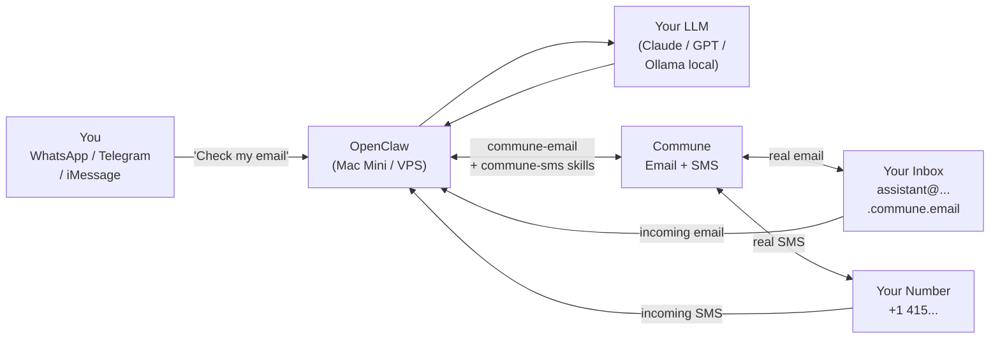

# Personal AI Assistant — Email & SMS with Commune

**Your OpenClaw agent, now with a real inbox and phone number. Ask it to check email while you're in a meeting. Have it text someone on your behalf. Get a morning briefing of unread threads — all from WhatsApp.**

---

## How It Works



Your OpenClaw agent bridges your chat app and the real world. When you message it on WhatsApp, it reads your email, composes replies, and sends texts — as you.

---

## What You Can Ask Your Agent

### Email Management

| What you say | What happens |
|-------------|-------------|
| "Summarize my unread emails" | Agent reads all threads with `last_direction: inbound`, extracts key points |
| "Which emails need a reply?" | Lists threads waiting on you, sorted by urgency |
| "Any urgent emails today?" | Agent scans for urgent language and flags them |
| "What's in my inbox?" | Full inbox summary with sender, subject, thread count |
| "Have I heard back from Sarah?" | Searches threads, checks last direction for Sarah's address |
| "How many unread threads do I have?" | Count of `inbound` threads from /v1/threads |

### Reading Email

| What you say | What happens |
|-------------|-------------|
| "Read me the email from Alex" | Semantic search for Alex's thread, reads full conversation |
| "What did the contractor say about the timeline?" | Searches inbox for contractor emails, reads relevant thread |
| "Show me the email about the contract" | Vector search: `q=contract` |
| "Read John's latest email" | Finds most recent thread from John |

### Sending Email

| What you say | What happens |
|-------------|-------------|
| "Email Sarah the meeting notes from today" | Composes and sends via Commune |
| "Send the invoice to client@acme.com" | Attaches context if you paste it, sends |
| "Email my landlord about the repair" | Composes appropriate message, sends from your inbox |
| "Send a follow-up to the job application I sent last week" | Searches for the original thread, replies with thread_id |

### Replying to Email

| What you say | What happens |
|-------------|-------------|
| "Reply to Mom's email and say I'll call Sunday" | Finds thread, sends reply keeping the thread intact |
| "Reply to the contract email and say we'll sign next week" | Finds thread, replies in your voice |
| "Tell the team I'm running 20 minutes late" | Finds the right thread, replies |
| "Decline the meeting invite from HR" | Finds thread, sends a polite decline |

### Searching Email

| What you say | What happens |
|-------------|-------------|
| "Find all emails about the lease agreement" | `GET /v1/search/threads?q=lease agreement` |
| "Search for anything about the contractor" | Semantic search, returns ranked results |
| "Did anyone email me about the invoice?" | Searches for invoice-related threads |
| "Find the email where Alex shared the doc link" | Natural language search works well |

### Inbox Intelligence

| What you say | What happens |
|-------------|-------------|
| "Mark the billing thread as resolved" | `PUT /v1/threads/:id/status { "status": "closed" }` |
| "Tag this as urgent" | `POST /v1/threads/:id/tags` |
| "Which threads have I not replied to in over a week?" | Lists inbound threads, filters by date |

### SMS

| What you say | What happens |
|-------------|-------------|
| "Text +14155551234 that I'm running 10 minutes late" | `POST /v1/sms/send` |
| "Send the client a text that their order shipped" | Sends SMS from your Commune number |
| "What did John text me?" | Reads SMS conversation with John's number |
| "Show me my recent texts" | Lists all SMS conversations |
| "Has anyone texted me today?" | Lists conversations, checks timestamps |
| "Text Mom happy birthday" | Sends if you've set Mom's number in USER.md |

### Automation

| What you say | What happens |
|-------------|-------------|
| "Every morning summarize my inbox" | Sets up recurring task (see Morning Briefing below) |
| "Let me know on WhatsApp if I get an email from my bank" | Event-driven monitoring |
| "Check my email every hour and text me if anything urgent arrives" | Polling + conditional SMS |

---

## Setup

### 1. Get Your Commune API Key

Sign up at [commune.email](https://commune.email) and copy your API key from the dashboard. It starts with `comm_`.

### 2. Install the Skills

```bash
git clone https://github.com/commune-email/email-for-agents
cp -r email-for-agents/commune-openclaw-starter/skills/commune-email ~/.openclaw/workspace/skills/
cp -r email-for-agents/commune-openclaw-starter/skills/commune-sms ~/.openclaw/workspace/skills/
```

### 3. Set Environment Variables

Add to your shell profile (`~/.zshrc`, `~/.bashrc`) or your OpenClaw env config:

```bash
export COMMUNE_API_KEY=comm_your_key_here
export COMMUNE_INBOX_ID=             # set after step 4
export COMMUNE_INBOX_ADDRESS=        # set after step 4
export COMMUNE_PHONE_ID=             # set after step 5 (optional)
export COMMUNE_PHONE_NUMBER=         # set after step 5 (optional)
```

### 4. Create Your Personal Inbox

Ask your agent directly:

```
You: Create me a Commune inbox called "personal"
Agent: Created inbox: personal@yourdomain.commune.email | ID: inbox_xxx

You: Great. Now remember this as my default inbox.
Agent: Got it. I'll use personal@yourdomain.commune.email for all email operations.
```

Or via CLI:

```bash
node ~/.openclaw/workspace/skills/commune-email/commune.js create-inbox personal
# → Created inbox: personal@yourdomain.commune.email | ID: inbox_xxx
export COMMUNE_INBOX_ID=inbox_xxx
export COMMUNE_INBOX_ADDRESS=personal@yourdomain.commune.email
```

### 5. Get a Phone Number (Optional)

Provision a phone number at [commune.email/dashboard](https://commune.email/dashboard), then:

```bash
node ~/.openclaw/workspace/skills/commune-sms/commune-sms.js list-numbers
# → +14155551234 — ID: pn_xxx
export COMMUNE_PHONE_ID=pn_xxx
export COMMUNE_PHONE_NUMBER=+14155551234
```

### 6. Tell Your Agent About Yourself

Add to `~/.openclaw/workspace/USER.md` (your agent reads this to understand you):

```markdown
## Email

My Commune inbox: personal@yourdomain.commune.email
Inbox ID: inbox_xxx

When checking email:
- Lead with urgent items first
- Skip newsletters and automated notifications unless I ask
- Group replies by person when there are multiple threads

Reply style: casual but professional. Use my first name to sign off.

## SMS

My Commune phone number: +14155551234
Phone number ID: pn_xxx

Common contacts:
- Mom: +15105550001
- Sarah (work): +14085550002
- Contractor (Mike): +16505550003

## Preferences

If anything looks urgent, notify me immediately — don't wait for me to ask.
Check email when I ask, don't poll unless I set up a schedule.
```

---

## Teach Your Agent Its Role

Add to your agent's `SOUL.md` to make email and SMS part of its core identity:

```markdown
## Communication

I have access to [Your Name]'s real email inbox and SMS line via Commune.

My email address: personal@yourdomain.commune.email (inbox_id: inbox_xxx)
My SMS number: +14155551234 (phone_number_id: pn_xxx)

When asked to check email, I:
1. List threads with last_direction: inbound (waiting for reply)
2. Read urgent ones in full
3. Summarize by sender and urgency

When replying to email, I always:
- Include thread_id to keep conversations threaded
- Write in [Your Name]'s voice — see USER.md for style notes
- Confirm before sending if unsure of tone or content

When sending SMS, I:
- Normalize numbers to E.164 format
- Keep messages concise and natural
```

---

## Advanced: Morning Briefing

Set up your agent to run every morning and send a WhatsApp summary of your inbox.

In OpenClaw's scheduler or `AGENTS.md`, add a recurring task:

```markdown
## Scheduled Tasks

### Morning Email Briefing
Schedule: every day at 8:00 AM local time
Action: Check Commune inbox, summarize unread threads by urgency, send summary to my WhatsApp.

Format:
- Start with "Good morning. Here's your inbox:"
- List urgent items first (flag if sender is known contact or subject contains urgent/asap/deadline)
- Then: X other threads waiting for reply
- End with: "Reply count needed: X"
```

The agent will:
1. `GET /v1/threads?inbox_id=...&limit=50`
2. Filter for `last_direction: inbound`
3. Classify by urgency (read thread content if needed)
4. Send you a WhatsApp summary
5. Optionally: ask if you want it to draft replies for anything

---

## Privacy Note

All email content is processed through your chosen LLM. If you're using a local model (Ollama, LM Studio, or similar), your email content never leaves your device. If using a cloud LLM (Claude, GPT-4), email content is sent to that provider's API — the same privacy posture as using any AI assistant.

Commune itself stores your emails on their infrastructure, similar to any email provider. Review [commune.email/privacy](https://commune.email/privacy) for details.

---

## Troubleshooting

**"Agent doesn't seem to know about my inbox"**
Add your inbox address and ID to `USER.md`. The agent reads this on every session start.

**"Agent sent a reply as a new thread instead of a reply"**
The `thread_id` was missing from the send call. Make sure the agent reads the thread first and passes `thread_id` in the reply body.

**"SMS send failed"**
Check that the number is in E.164 format (`+14155551234`) and that `COMMUNE_PHONE_ID` is set correctly.

**"Search isn't finding my emails"**
Vector search needs a moment after new emails arrive. Also try rephrasing — natural language queries work better than keywords alone.
