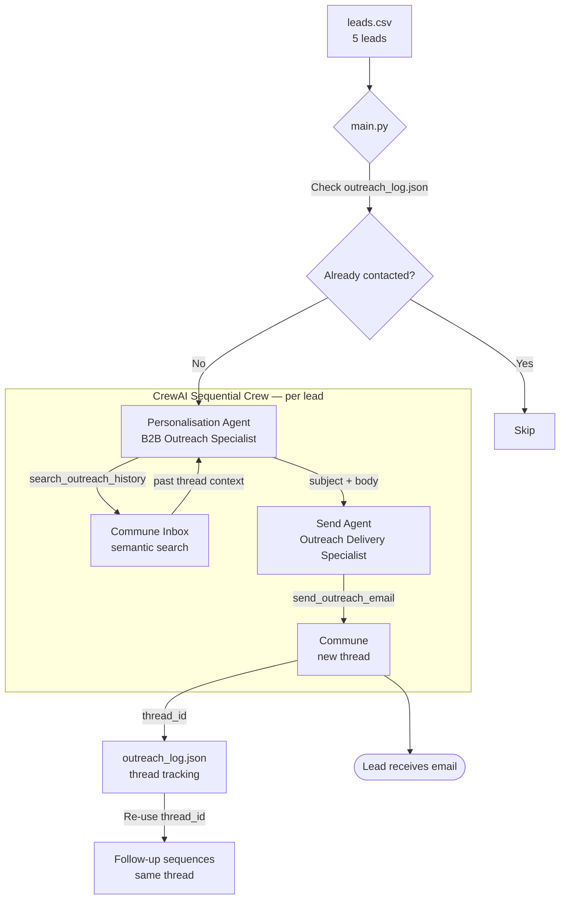

# CrewAI Lead Outreach Crew

Two specialized agents collaborate to write and send personalised B2B cold outreach emails — Personalisation, then Send.

---

## Architecture



---

## How It Works

The crew processes one lead at a time in a sequential two-agent pipeline.

1. **Personalisation Agent** receives the lead's name, role, company, and notes. It optionally calls `search_outreach_history` to check whether we have context from past outreach to similar companies. It then writes a short (under 120 words), specific cold email and subject line anchored to a detail from the lead's notes.

2. **Send Agent** receives the draft and calls `send_outreach_email` to deliver it via Commune. The returned `thread_id` is included in its output.

3. **main.py** extracts the `thread_id` from the crew result and writes it to `outreach_log.json`. On subsequent runs, already-contacted leads (by email) are skipped automatically. The thread_id is the key to sending follow-ups in the same thread later.

---

## Setup

### 1. Install dependencies

```bash
pip install -r requirements.txt
```

### 2. Configure environment

```bash
cp .env.example .env
# Fill in COMMUNE_API_KEY and OPENAI_API_KEY
```

Or export directly:

```bash
export COMMUNE_API_KEY=comm_your_key_here
export OPENAI_API_KEY=sk-your_key_here
```

### 3. Edit leads.csv

The included `leads.csv` has 5 sample leads. Replace them with your own. The columns are:

| Column | Description |
|--------|-------------|
| `name` | Lead's full name |
| `email` | Lead's email address |
| `company` | Company name |
| `role` | Lead's job title |
| `notes` | Context for personalisation — recent news, pain points, LinkedIn activity |

### 4. Run the crew

```bash
python main.py
```

The crew will process each uncontacted lead sequentially, printing progress to stdout and saving results to `outreach_log.json`.

---

## Example Output

```
Commune Outreach Crew | sending from: outreach@yourdomain.commune.email
Total leads: 5 | Already contacted: 0 | Pending: 5

Processing: Sarah Chen <sarah.chen@vertexlogistics.com> at Vertex Logistics

> Personalisation Agent starting...
> Calling tool: search_outreach_history(query="logistics operations warehouse")
> No highly relevant past threads found — writing fresh angle.
> Subject: Cutting fulfillment costs across 3 new Vertex locations
> Body: Hi Sarah, saw Vertex's expansion announcement — managing fulfillment
>   costs across three new warehouses simultaneously is a real coordination
>   challenge. We help ops teams like yours automate the communication layer
>   so nothing falls through as you scale. Worth a quick 15 mins to compare
>   notes? — [Your name]

> Send Agent starting...
> Calling tool: send_outreach_email(to="sarah.chen@vertexlogistics.com", ...)
> {"status": "sent", "message_id": "msg_abc", "thread_id": "thrd_xyz", "to": "sarah.chen@..."}

Sent to Sarah Chen | thread_id: thrd_xyz

Waiting 5s before next send...
Processing: Marcus Webb <m.webb@helixsoftware.io> at Helix Software
...

Outreach complete.
Successfully contacted: 5/5 leads
Thread IDs saved to: outreach_log.json
```

---

## outreach_log.json format

After a run, `outreach_log.json` holds the tracking record for every contacted lead:

```json
{
  "sarah.chen@vertexlogistics.com": {
    "name": "Sarah Chen",
    "company": "Vertex Logistics",
    "role": "Head of Operations",
    "thread_id": "thrd_xyz123",
    "sent_at": "2024-01-15T10:30:00",
    "status": "sent"
  }
}
```

Use the `thread_id` to send follow-ups in the same thread:

```python
from commune import CommuneClient
commune = CommuneClient(api_key="comm_...")

commune.messages.send(
    to="sarah.chen@vertexlogistics.com",
    subject="Re: Cutting fulfillment costs across 3 new Vertex locations",
    text="Hi Sarah, just wanted to follow up...",
    inbox_id=inbox_id,
    thread_id="thrd_xyz123",  # from outreach_log.json
)
```

---

## File Structure

```
outreach-crew/
├── crew.py              # Agent definitions, tools, and crew factory
├── main.py              # Reads leads.csv, runs crew per lead, saves log
├── leads.csv            # Sample leads (replace with your own)
├── outreach_log.json    # Created on first run — tracks thread_ids
├── requirements.txt
├── .env.example
└── README.md
```

---

## Extending the Crew

- **Add a review step** — insert a third `review_agent` between personalisation and send, tasked with scoring and improving the draft before it goes out.
- **CRM integration** — replace `leads.csv` with a call to HubSpot, Salesforce, or any CRM API to pull live lead lists.
- **Follow-up sequences** — use the saved `thread_id` values in a scheduled job that calls `send_followup_email` 3 and 7 days after the first send.
- **Reply detection** — poll `commune.threads.list()` and check `last_direction` — if `inbound`, the lead replied. Route them to a qualification crew.
- **SMS escalation** — if a lead doesn't reply to email within 7 days, use `commune.sms.send()` to send a brief SMS nudge.
