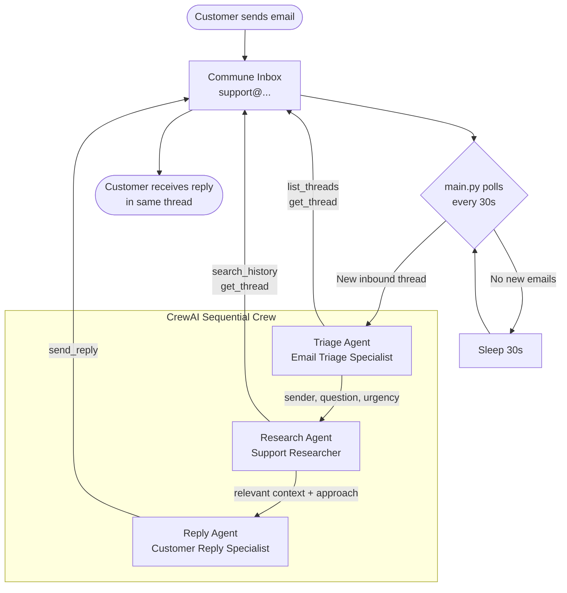

# CrewAI Customer Support Crew

Three specialized agents collaborate to handle customer emails — Triage, Research, Reply.

---

## Architecture



---

## How It Works

The crew runs sequentially — each agent hands its output to the next as context.

1. **Triage Agent** calls `list_threads` and `get_thread` to read the inbox. It extracts the sender's email, the core question, urgency level, and any specific details (order IDs, account info, etc.).

2. **Research Agent** receives the triage summary and calls `search_history` with semantic queries to find relevant prior threads. It reads any matching thread with `get_thread` and synthesises a briefing: what the standard answer is, what worked before, and any caveats.

3. **Reply Agent** receives both summaries and calls `send_reply` to send a concise, professional reply into the original thread. The `thread_id` is always passed so the customer sees a single conversation chain.

The polling loop in `main.py` tracks handled thread IDs in memory, preventing duplicate replies within a session.

---

## Setup

### 1. Install dependencies

```bash
pip install -r requirements.txt
```

### 2. Configure environment

```bash
cp .env.example .env
# Fill in COMMUNE_API_KEY and OPENAI_API_KEY
```

Or export directly:

```bash
export COMMUNE_API_KEY=comm_your_key_here
export OPENAI_API_KEY=sk-your_key_here
```

### 3. Run the crew

```bash
python main.py
```

The inbox address is printed at startup. Send an email there to trigger the crew.

---

## Example Output

```
CrewAI Support Crew running | inbox: support@yourdomain.commune.email
Polling every 30 seconds. Send an email to the inbox address to test.

New inbound thread: [thrd_abc123] How do I cancel my subscription?

> Triage Agent starting...
> Calling tool: get_thread(thread_id="thrd_abc123")
> Extracted: sender=alice@example.com, question=cancel subscription, urgency=low

> Research Agent starting...
> Calling tool: search_history(query="cancel subscription account")
> Found 2 relevant past threads — summarising resolution approach...

> Reply Agent starting...
> Calling tool: send_reply(to="alice@example.com", subject="Re: How do I cancel my subscription?", ...)
> {"status": "sent", "message_id": "msg_xyz789", "thread_id": "thrd_abc123"}

Crew finished for thread thrd_abc123.
```

---

## File Structure

```
support-crew/
├── crew.py           # Agent definitions, tools, and crew factory
├── main.py           # Polling loop — runs the crew per new inbound thread
├── requirements.txt
├── .env.example
└── README.md
```

---

## Extending the Crew

- **Add a knowledge base tool** — wrap a directory of `.md` files or a vector store as a `@tool` and give it to the Research Agent.
- **Escalation** — add a `create_ticket` tool that calls Zendesk or Linear when the Research Agent returns no relevant context.
- **Urgency routing** — inspect the Triage Agent's output before running the full crew; skip to a human handoff tool for `urgency=high` cases.
- **Webhooks instead of polling** — expose a FastAPI endpoint, register it as a Commune webhook, and trigger `create_support_crew().kickoff()` on each `message.created` event.
- **Different LLM** — set `OPENAI_MODEL_NAME=gpt-4o-mini` to reduce cost, or pass `llm=` directly to each `Agent` constructor to use any LiteLLM-compatible model.
