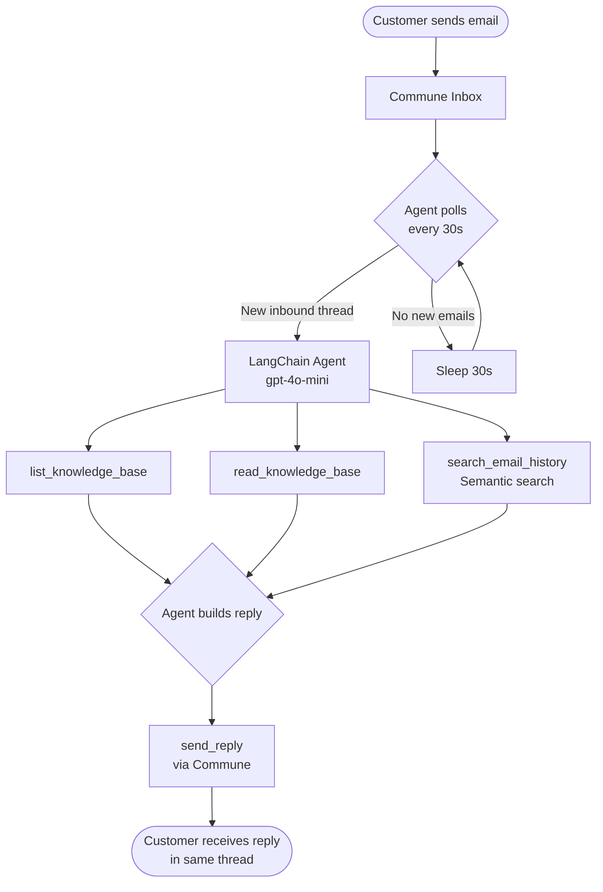

# LangChain Customer Support Agent

An AI agent that monitors a Commune email inbox, reads inbound support emails, searches a local knowledge base, and sends professional replies — fully automated using LangChain's tool-calling agent pattern.

---

## Architecture



---

## How It Works

1. **Polling loop** — the agent calls `commune.threads.list()` every 30 seconds, filtering for threads where the last message is inbound (i.e. from a customer) and haven't been handled yet.

2. **Tool-calling agent** — each inbound email is passed to a LangChain `AgentExecutor` with four tools:
   - `list_knowledge_base` — lists all `.md` files in `knowledge_base/`
   - `read_knowledge_base` — reads a specific doc by ID
   - `search_email_history` — semantic search over past Commune threads to surface relevant prior conversations
   - `send_reply` — sends a reply into the existing thread (preserving the thread context)

3. **Thread-aware replies** — every reply is sent with the original `thread_id`, so the customer sees the conversation as a single email chain.

4. **Handled tracking** — a local `handled` set prevents the agent from replying to the same thread twice in the same session.

---

## Setup

### 1. Install dependencies

```bash
pip install -r requirements.txt
```

### 2. Configure environment

```bash
cp .env.example .env
# Edit .env with your keys
```

### 3. Set environment variables

```bash
export COMMUNE_API_KEY=comm_your_key_here
export OPENAI_API_KEY=sk-your_key_here
```

Or use a tool like `direnv` or `python-dotenv`.

### 4. Run the agent

```bash
python agent.py
```

Send an email to your Commune inbox address (printed at startup) to test.

---

## Example Terminal Output

```
✅ Support agent running | inbox: support@inbound.commune.dev
Send an email to your inbox address to test.

📨 New email from alice@example.com: How do I cancel my subscription?

> Entering new AgentExecutor chain...
Invoking: `list_knowledge_base` with `{}`
[{"id": "billing", "title": "Billing & Subscription Policies"}, {"id": "faq", "title": "Frequently Asked Questions"}]

Invoking: `read_knowledge_base` with `{"doc_id": "billing"}`
# Billing & Subscription Policies
...

Invoking: `send_reply` with `{"to": "alice@example.com", "subject": "Re: How do I cancel my subscription?", "body": "Hi Alice,\n\nYou can cancel at any time from Settings → Billing → Cancel Plan...", "thread_id": "thrd_abc123"}`
{"status": "sent", "message_id": "msg_xyz789"}

> Finished chain.
```

---

## File Structure

```
customer-support/
├── agent.py                  # Main agent — polling loop + LangChain agent
├── knowledge_base/
│   ├── faq.md                # General FAQ entries
│   └── billing.md            # Billing and subscription policies
├── requirements.txt
├── .env.example
└── README.md
```

---

## Extending the Agent

- **Add more knowledge base docs** — drop any `.md` file into `knowledge_base/`. The agent will discover it automatically via `list_knowledge_base`.
- **Connect a vector store** — replace `read_knowledge_base` with a FAISS or Chroma retriever for large knowledge bases.
- **Add escalation logic** — add a `create_ticket` tool that calls your helpdesk API (Linear, Zendesk, etc.) when the agent can't find an answer.
- **Webhook instead of polling** — expose a FastAPI endpoint and configure Commune webhooks to push new messages instead of polling.
