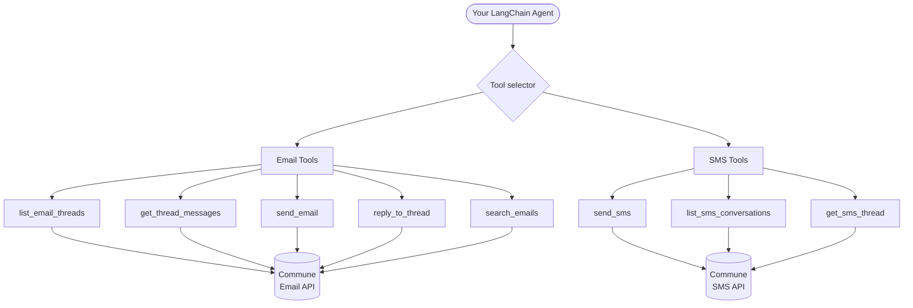

# LangChain Email & SMS Tools for Commune

A reusable, drop-in set of LangChain tools that wrap the full Commune Email and SMS API. Import `get_email_tools` or `get_sms_tools` into any LangChain agent — no glue code required.

---

## Architecture



---

## Quick Start

### 1. Install

```bash
pip install -r requirements.txt
```

### 2. Set environment variables

```bash
export COMMUNE_API_KEY=comm_your_key_here
export OPENAI_API_KEY=sk-your_key_here
```

### 3. Drop tools into your agent

```python
from commune_tools import get_email_tools, get_sms_tools

# Email tools — pass your Commune inbox_id
email_tools = get_email_tools(inbox_id="your_inbox_id")

# SMS tools — pass your Commune phone_number_id
sms_tools = get_sms_tools(phone_number_id="your_phone_number_id")

# Use with any LangChain agent
tools = email_tools + sms_tools
```

See `example_usage.py` for a complete working agent.

---

## Email Tools Reference

All functions returned by `get_email_tools(inbox_id, client=None)`:

| Tool | Description |
|---|---|
| `list_email_threads(limit)` | List recent threads. Returns thread_id, subject, direction, message count. |
| `get_thread_messages(thread_id)` | Get full message history for a thread, including sender and content. |
| `send_email(to, subject, body)` | Send a new email (starts a new thread). |
| `reply_to_thread(thread_id, to, subject, body)` | Reply within an existing thread. Prefer this over `send_email` when replying. |
| `search_emails(query)` | Semantic search across all threads using natural language. |

## SMS Tools Reference

All functions returned by `get_sms_tools(phone_number_id, client=None)`:

| Tool | Description |
|---|---|
| `send_sms(to, message)` | Send an SMS. `to` must be E.164 format (+14155551234). |
| `list_sms_conversations()` | List active SMS conversations with remote number and preview. |
| `get_sms_thread(remote_number)` | Get all messages with a specific phone number. |

---

## Usage Patterns

### Share a single client across email and SMS

```python
from commune import CommuneClient
from commune_tools import get_email_tools, get_sms_tools

client = CommuneClient(api_key="comm_...")
email_tools = get_email_tools(inbox_id="inb_123", client=client)
sms_tools   = get_sms_tools(phone_number_id="phn_456", client=client)
```

### Use only email tools

```python
tools = get_email_tools(inbox_id="inb_123")
# → [list_email_threads, get_thread_messages, send_email, reply_to_thread, search_emails]
```

### Use only SMS tools

```python
tools = get_sms_tools(phone_number_id="phn_456")
# → [send_sms, list_sms_conversations, get_sms_thread]
```

### Pick specific tools

```python
all_email_tools = get_email_tools(inbox_id="inb_123")
# Take only the tools you want
tools = [t for t in all_email_tools if t.name in ("send_email", "search_emails")]
```

---

## File Structure

```
email-sms-tools/
├── commune_tools.py     # All LangChain tool definitions — import this
├── example_usage.py     # Complete working agent using the tools
├── requirements.txt
├── .env.example
└── README.md
```
