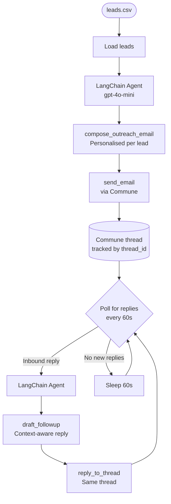

# LangChain Lead Outreach Agent

An AI agent that reads a list of leads from a CSV file, crafts a personalised outreach email for each lead using an LLM, sends the emails via Commune, then monitors for replies and automatically continues the conversation.

---

## Architecture



---

## How It Works

### Phase 1 — Initial Outreach

1. The agent reads `leads.csv` (name, email, company, role, notes).
2. For each uncontacted lead it invokes `compose_outreach_email` — a tool that calls the LLM to write a personalised cold email referencing the lead's company, role, and notes.
3. `send_email` sends the email via Commune. The returned `thread_id` is stored in a local JSON file (`sent_threads.json`) so the conversation can be tracked across restarts.
4. A short delay between sends avoids rate limits and looks more human.

### Phase 2 — Reply Monitoring

1. After the outreach loop, the agent enters a polling loop.
2. Every 60 seconds it checks each tracked thread for inbound replies.
3. When a reply is found, the agent calls `draft_followup` with the full conversation history, then `reply_to_thread` to send the response in the same thread.
4. Threads are marked as `awaiting_reply` or `replied` so the agent never double-sends.

---

## Setup

### 1. Install dependencies

```bash
pip install -r requirements.txt
```

### 2. Configure environment

```bash
cp .env.example .env
# Edit .env with your keys
```

### 3. Edit leads.csv

Update `leads.csv` with your real leads. The CSV must have columns: `name`, `email`, `company`, `role`, `notes`.

### 4. Run the agent

```bash
export COMMUNE_API_KEY=comm_your_key_here
export OPENAI_API_KEY=sk-your_key_here
python agent.py
```

---

## Example Terminal Output

```
✅ Lead outreach agent running
Loaded 5 leads from leads.csv

--- Sending to Alex Chen (Acme Corp) ---
> Entering new AgentExecutor chain...
Invoking: `compose_outreach_email` with {"lead": {...}}
Subject: Helping Acme Corp scale engineering visibility
Body: Hi Alex, I came across Acme Corp and noticed you're scaling your platform...

Invoking: `send_email` with {"to": "alex@acme.com", ...}
{"status": "sent", "thread_id": "thrd_abc123"}
Sent to alex@acme.com | thread: thrd_abc123

--- Sending to Maria Santos (Globex) ---
...

All leads contacted. Entering reply monitoring loop...

[60s] Checking 5 threads for replies...
[reply] alex@acme.com replied in thrd_abc123: "Thanks for reaching out..."
Drafting follow-up...
Replied to alex@acme.com in thread thrd_abc123.
```

---

## File Structure

```
lead-outreach/
├── agent.py              # Main agent — outreach + reply monitoring
├── leads.csv             # Lead list (name, email, company, role, notes)
├── sent_threads.json     # Auto-created: maps lead email → thread_id + status
├── requirements.txt
├── .env.example
└── README.md
```

---

## Extending the Agent

- **CRM sync** — add a `log_to_crm` tool that posts updates to HubSpot or Salesforce after each send/reply.
- **Unsubscribe handling** — check reply content for opt-out language and set status to `unsubscribed` instead of drafting a follow-up.
- **Multi-step sequences** — track `follow_up_count` per lead and adjust messaging for follow-up #2, #3, etc.
- **A/B testing** — pass a `variant` field in leads.csv and route to different prompt templates in `compose_outreach_email`.
