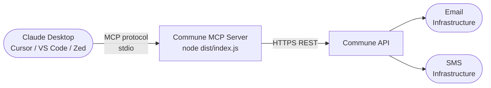

# Commune MCP Server — Email & SMS for Claude, Cursor & VS Code

Add email and SMS superpowers to any MCP-compatible AI. Gives Claude Desktop, Cursor, and VS Code access to 13 email & SMS tools powered by Commune.

```
"Check my support inbox, summarize the unread threads, and reply to anything about billing"
```

That's it. Claude reads, writes, searches, and organizes your email and SMS — right from the chat.

---

## Compatibility

| Client | Status |
|---|---|
| Claude Desktop | Supported |
| Cursor | Supported |
| VS Code (GitHub Copilot) | Supported |
| Zed | Supported |
| Any MCP-compatible client | Supported |

---

## Architecture



The MCP server runs as a local process on your machine. Claude communicates with it over stdio using the Model Context Protocol. The server then calls the Commune API on your behalf — your API key never leaves your machine.

---

## Quickstart

### 1. Get a Commune API key

Sign up at [commune.email](https://commune.email) and copy your API key from the dashboard. It starts with `comm_`.

### 2. Build the server

```bash
git clone https://github.com/commune-email/email-for-agents
cd email-for-agents/mcp-server
npm install && npm run build
```

Note the absolute path to the built file — you'll need it in the next step:

```bash
pwd
# e.g. /Users/you/email-for-agents/mcp-server
# dist file will be at /Users/you/email-for-agents/mcp-server/dist/index.js
```

### 3. Configure your MCP client

#### Claude Desktop

Open the config file:

- **macOS:** `~/Library/Application Support/Claude/claude_desktop_config.json`
- **Windows:** `%APPDATA%\Claude\claude_desktop_config.json`

Add the `commune` entry:

```json
{
  "mcpServers": {
    "commune": {
      "command": "node",
      "args": ["/absolute/path/to/mcp-server/dist/index.js"],
      "env": {
        "COMMUNE_API_KEY": "comm_your_key_here"
      }
    }
  }
}
```

Replace `/absolute/path/to/mcp-server/dist/index.js` with the real path from step 2. Restart Claude Desktop — you should see the Commune tools appear in the tools panel.

#### Cursor

Add to `.cursor/mcp.json` in your project root (or `~/.cursor/mcp.json` for global):

```json
{
  "mcpServers": {
    "commune": {
      "command": "node",
      "args": ["/absolute/path/to/mcp-server/dist/index.js"],
      "env": {
        "COMMUNE_API_KEY": "comm_your_key_here"
      }
    }
  }
}
```

#### VS Code (GitHub Copilot)

Add to `.vscode/mcp.json`:

```json
{
  "servers": {
    "commune": {
      "type": "stdio",
      "command": "node",
      "args": ["/absolute/path/to/mcp-server/dist/index.js"],
      "env": {
        "COMMUNE_API_KEY": "comm_your_key_here"
      }
    }
  }
}
```

#### Zed

Add to `~/.config/zed/settings.json`:

```json
{
  "context_servers": {
    "commune": {
      "command": {
        "path": "node",
        "args": ["/absolute/path/to/mcp-server/dist/index.js"],
        "env": {
          "COMMUNE_API_KEY": "comm_your_key_here"
        }
      }
    }
  }
}
```

---

## Tools reference

13 tools across email and SMS:

| Tool | Category | Description |
|---|---|---|
| `commune_list_inboxes` | Email | List all inboxes and their addresses |
| `commune_create_inbox` | Email | Create a new inbox (e.g. `support@yourdomain.commune.email`) |
| `commune_list_threads` | Email | List threads in an inbox, flagged by reply status |
| `commune_get_thread` | Email | Fetch all messages in a thread |
| `commune_send_email` | Email | Send a new email or reply in an existing thread |
| `commune_search_emails` | Email | Semantic search across threads using natural language |
| `commune_set_thread_status` | Email | Set status: `open`, `needs_reply`, `waiting`, or `closed` |
| `commune_tag_thread` | Email | Add tags to a thread for triage and routing |
| `commune_list_phone_numbers` | SMS | List provisioned phone numbers |
| `commune_send_sms` | SMS | Send an SMS to any E.164 number |
| `commune_list_sms_conversations` | SMS | List all SMS conversations |
| `commune_get_sms_thread` | SMS | Fetch full message history with a specific number |
| `commune_search_sms` | SMS | Semantic search across SMS messages |

---

## Example prompts

Try these in Claude Desktop after connecting the server:

**Email**

```
Create an inbox called "support" and give me the email address
```

```
Check my support inbox and summarize the last 5 email threads
```

```
Which threads in my inbox are still waiting for a reply?
```

```
Read thread abc123 and reply saying the issue has been resolved, then mark it closed
```

```
Search my emails for anything related to billing disputes
```

```
Tag all threads mentioning "refund" with the tags billing and urgent
```

**SMS**

```
Send a text to +14155551234 saying "Your order has shipped, expected delivery Friday"
```

```
Show me all SMS conversations and summarize any that need a reply
```

```
Search my SMS messages for anything about appointment cancellations
```

**Combined workflows**

```
Check my support inbox, find any emails about shipping delays, reply to each one,
mark them waiting, and send an SMS update to any customer who left a phone number
```

```
Create a daily briefing: summarize all open email threads and any unanswered SMS
conversations from the last 24 hours
```

---

## Development

Run in development mode with live reload (no build step required):

```bash
npm run dev
```

Build for production:

```bash
npm run build
# output: dist/index.js
```

Run the built server directly (useful for testing outside of an MCP client):

```bash
COMMUNE_API_KEY=comm_your_key node dist/index.js
```

The server communicates over stdio. If it starts correctly you'll see:

```
Commune MCP server running on stdio
```

Inspect the tool schemas without a client using the MCP inspector:

```bash
npx @modelcontextprotocol/inspector node dist/index.js
```

---

## Environment variables

| Variable | Required | Description |
|---|---|---|
| `COMMUNE_API_KEY` | Yes | Your Commune API key (starts with `comm_`) |

Copy `.env.example` to `.env` for local development:

```bash
cp .env.example .env
# then edit .env and add your key
```

The `.env` file is for local tooling only. In production MCP clients, pass the key via the `env` field in the client config as shown above — the MCP client injects it as a process environment variable when it spawns the server.

---

## How it works

The server implements the [Model Context Protocol](https://modelcontextprotocol.io/) using the official `@modelcontextprotocol/sdk`. It runs as a stdio subprocess — the MCP client (Claude Desktop, Cursor, etc.) spawns it on startup, sends JSON-RPC messages over stdin, and reads responses from stdout. Logs go to stderr and are visible in the client's MCP console.

Each tool maps directly to one or more calls in the `commune-ai` TypeScript SDK. There is no network proxy, no additional server, and no data persisted locally — every call goes directly from the MCP server process to the Commune API over HTTPS.

---

## Troubleshooting

**Tools don't appear in Claude Desktop**

1. Check the config file path and JSON syntax — a single missing comma will break parsing.
2. Confirm the path in `args` is absolute and the file exists: `ls /your/path/to/dist/index.js`
3. Restart Claude Desktop fully (Cmd+Q, not just close the window).
4. Open the MCP console in Claude Desktop (Settings > Developer) and check for error output.

**`Error: COMMUNE_API_KEY is not set`**

The `env` field in the MCP config is required. Make sure your key is in the `env` block of the client config, not just in a local `.env` file.

**`Error: Cannot find module`**

Run `npm run build` from the `mcp-server/` directory. The `dist/` folder must exist before pointing a client at `dist/index.js`.

**Tool call returns an error**

The server returns errors as text content rather than crashing, so Claude will read the error message and can often self-correct. Check that the inbox ID, thread ID, or phone number ID you're using is valid by calling the corresponding `list` tool first.

---

## License

MIT — see [LICENSE](../LICENSE).
