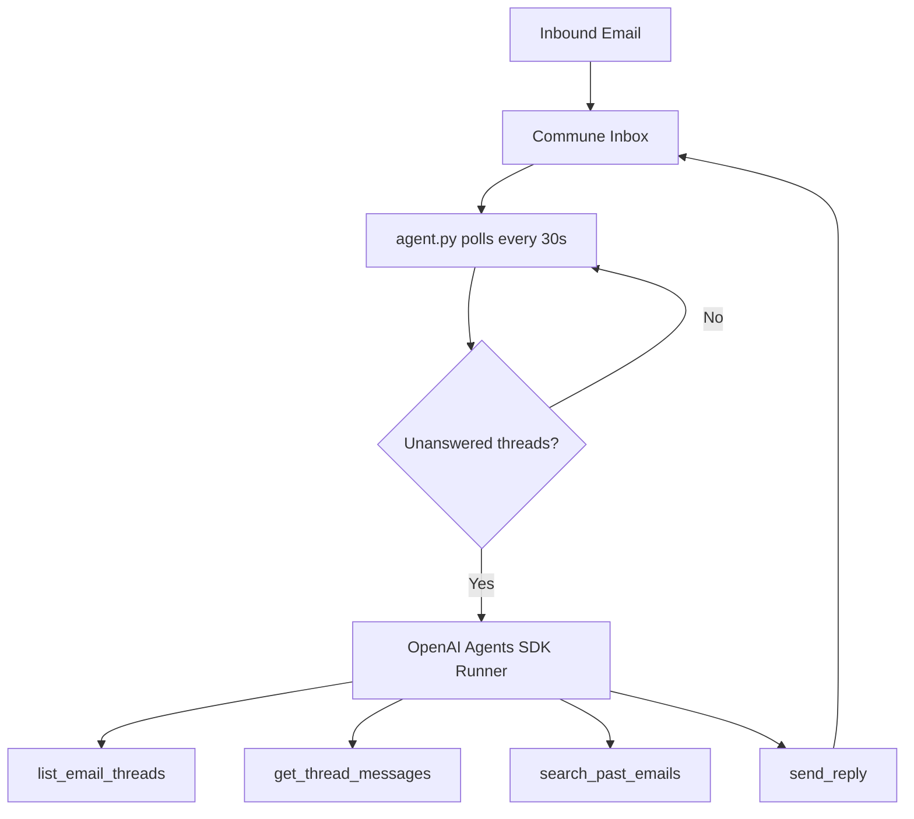

# OpenAI Agents SDK — Email Support Agent

A full customer support agent built with [OpenAI's official Agents SDK](https://github.com/openai/openai-agents-python) (`openai-agents` package) and [Commune](https://commune.sh) as the email backend.

The agent polls for inbound emails, reads each conversation in full, optionally searches past threads for context, then replies — all driven by GPT-4o-mini using the `@function_tool` decorator pattern.

## Architecture



## Tools

| Tool | What it does |
|------|-------------|
| `list_email_threads` | Lists recent threads with `waiting_for_reply` flag |
| `get_thread_messages` | Reads the full message history of a thread |
| `send_reply` | Sends a reply in an existing thread (keeps conversation threaded) |
| `search_past_emails` | Semantic search across all past threads |

## Setup

**1. Install dependencies**

```bash
pip install -r requirements.txt
```

**2. Set environment variables**

```bash
cp .env.example .env
# Edit .env and fill in your keys
```

Or export directly:

```bash
export COMMUNE_API_KEY=comm_...
export OPENAI_API_KEY=sk-...
```

Get a Commune API key at [commune.sh](https://commune.sh).

**3. Run the agent**

```bash
python agent.py
```

The agent creates (or reuses) a `support` inbox, then polls every 30 seconds. Send a test email to your inbox address and watch it respond.

## How it works

The OpenAI Agents SDK `Runner.run_sync` handles the full agentic loop — tool calls, results, follow-up reasoning — until the agent decides it is done. Each tool is a plain Python function decorated with `@function_tool`; the SDK automatically generates the JSON schema from the type hints and docstring.

```python
@function_tool
def send_reply(to: str, subject: str, body: str, thread_id: str) -> str:
    """Reply to an email thread. ALWAYS include thread_id to keep the conversation threaded."""
    result = commune.messages.send(to=to, subject=subject, text=body,
                                   inbox_id=INBOX_ID, thread_id=thread_id)
    return json.dumps({"status": "sent", "message_id": getattr(result, "message_id", "ok")})
```

The agent is given a system prompt at construction time (the `instructions` field on `Agent`) and is invoked with a short task description each polling cycle.

## Customisation

- **Change the inbox name** — pass a different `name` to `get_inbox()` at the bottom of `agent.py`.
- **Change the model** — update `model="gpt-4o-mini"` on the `Agent` constructor.
- **Add tools** — decorate any Python function with `@function_tool` and add it to the `tools` list.
- **Adjust polling interval** — change the `time.sleep(30)` value in `main()`.
