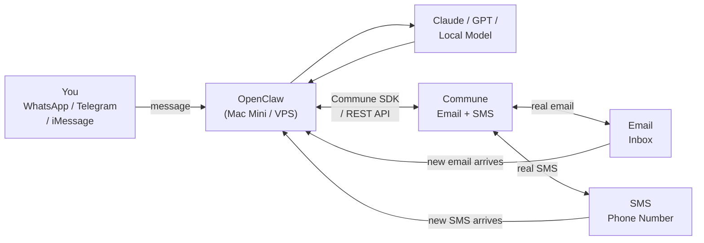
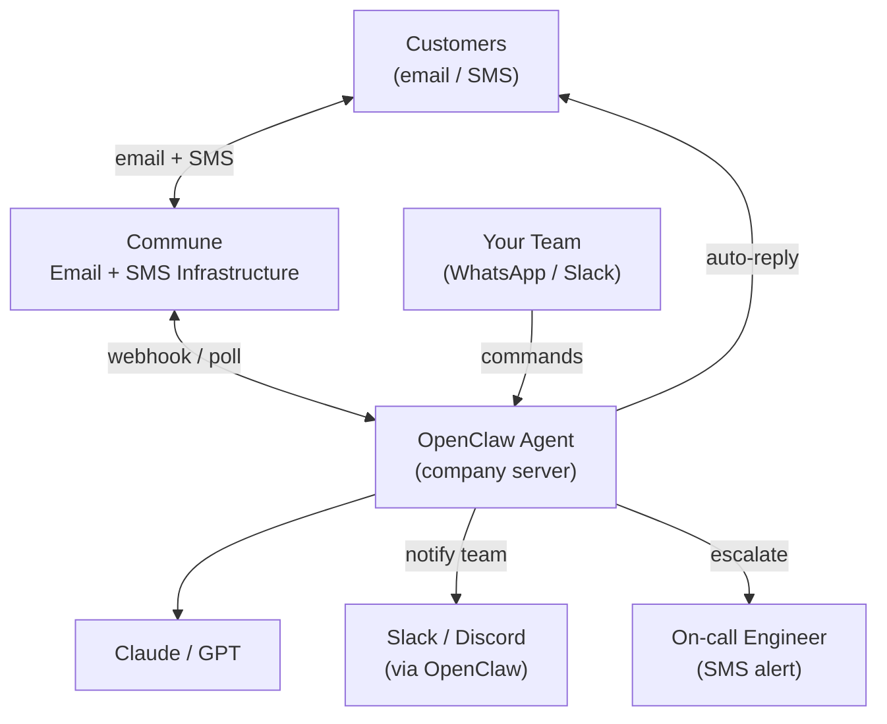

# Email & SMS for OpenClaw Agents

[](https://openclaw.ai)
[](https://commune.email)
[](#skills)

**Give your OpenClaw agent its own email address and phone number. Ask it to check email, reply to threads, and send SMS — from WhatsApp, Telegram, iMessage, or wherever your agent lives.**

---

## What This Unlocks

| Without Commune | With Commune |
|----------------|-------------|
| Agent can chat | Agent has its own inbox: `assistant@yourdomain.commune.email` |
| No email context | Agent reads, threads, searches your email |
| No SMS | Agent sends/receives SMS from a real phone number |
| One-off messages | Full conversation threading with RFC 5322 compliance |
| No external comms | Agent emails people on your behalf, tracks replies |

---

## Architecture

### Personal Use



### Company Use



---

## Two Ways to Use

### 1. Personal Assistant

OpenClaw manages your personal email and SMS inbox. You message your agent on WhatsApp, it checks email, replies, sends SMS on your behalf. You're in control — your agent is your proxy.

- "Check my email and tell me what's urgent"
- "Reply to Mom's email and say I'll call Sunday"
- "Text the client that I'm running 10 minutes late"

[Setup guide for personal use →](./use-cases/personal-assistant/README.md)

### 2. Company Agent

OpenClaw handles customer-facing email and SMS. Customers email `support@yourco.com`, OpenClaw triages, drafts replies, escalates urgent issues to Slack, and keeps your team informed — without a human touching the queue first.

- Full inbox triage: classify, prioritize, respond
- SMS escalation to on-call engineers
- Daily digest emails to management

[Setup guide for company use →](./use-cases/company-assistant/README.md)

---

## Skills

This starter includes two OpenClaw skills:

| Skill | What it does | File |
|-------|-------------|------|
| `commune-email` | Send, receive, search, and manage email threads | `skills/commune-email/SKILL.md` |
| `commune-sms` | Send SMS, read conversations, list phone numbers | `skills/commune-sms/SKILL.md` |
| `commune-agent-network` | Agent-to-agent task delegation via email addresses | `skills/commune-agent-network/SKILL.md` |

Each skill includes a companion Node.js CLI helper so your agent can shell out to perform operations without needing to construct raw HTTP requests.

---

## Installation

**Option 1: ClawHub (one command)**

```bash
clawhub install shanjairaj7/commune
```

This installs all Commune skills — email, SMS, and agent network — directly into your OpenClaw workspace.

**Option 2: Manual install**

```bash
# Clone and copy skills
git clone https://github.com/shanjai-raj/commune-openclaw-email-sms-quickstart
cd commune-openclaw-email-sms-quickstart

cp -r skills/commune-email ~/.openclaw/workspace/skills/
cp -r skills/commune-sms ~/.openclaw/workspace/skills/
cp -r skills/commune-agent-network ~/.openclaw/workspace/skills/
```

Then talk to your agent:

```
You: Check my email inbox and summarize what's new
Agent: [reads Commune inbox, summarizes threads]

You: Reply to Sarah's email about the contract and say we'll sign next week
Agent: [finds thread, sends reply via Commune]

You: Text +14155551234 that the meeting is moved to 3pm
Agent: [sends SMS via Commune]
```

---

## Quick Example Prompts

| Category | What you say | What the agent does |
|----------|-------------|---------------------|
| **Email triage** | "Summarize my unread emails" | Lists threads, extracts key points |
| **Email triage** | "Which emails need a reply?" | Finds threads with `last_direction: inbound` |
| **Email reading** | "Read the email from Alex about the contract" | Semantic search + full thread view |
| **Email sending** | "Email Sarah the meeting notes from today" | Composes and sends via Commune |
| **Email replying** | "Reply to Mom and say I'll call Sunday" | Finds thread, replies with `thread_id` |
| **Email search** | "Find anything about the lease agreement" | Vector search across inbox |
| **Email management** | "Mark the billing thread as resolved" | PUT `/v1/threads/:id/status` |
| **Email management** | "Tag this as urgent" | POST `/v1/threads/:id/tags` |
| **SMS sending** | "Text +14155551234 that I'm running 10 minutes late" | SMS via Commune phone number |
| **SMS reading** | "What did John text me yesterday?" | Reads SMS conversation by number |
| **SMS listing** | "Show me my recent texts" | Lists all SMS conversations |
| **Automation** | "Every morning summarize my inbox" | Recurring task via OpenClaw scheduler |
| **Automation** | "If I get an email from my bank, notify me on WhatsApp" | Event-driven agent behavior |
| **Company** | "How many support tickets came in today?" | Thread count from support inbox |
| **Company** | "Draft a reply to the refund request and show it to me first" | Draft workflow before sending |

---

## Environment Variables

| Variable | Required | Description |
|----------|----------|-------------|
| `COMMUNE_API_KEY` | Yes | Your Commune API key (`comm_...`) |
| `COMMUNE_INBOX_ID` | Recommended | Default inbox ID for email operations |
| `COMMUNE_INBOX_ADDRESS` | Recommended | Your full inbox address (e.g. `me@domain.commune.email`) |
| `COMMUNE_PHONE_ID` | Optional | Default phone number ID for SMS |

---

## Full Setup Guide

See [setup/README.md](./setup/README.md) for step-by-step installation, inbox creation, troubleshooting, and `USER.md`/`SOUL.md` templates.

---

## About Commune

[Commune](https://commune.email) provides real email inboxes and phone numbers via a REST API. Every inbox is RFC 5322 compliant — replies thread correctly in any email client. Built-in spam filtering and prompt injection detection protect your agent from malicious inbound content.

**Base URL:** `https://api.commune.email`
**Auth:** `Authorization: Bearer $COMMUNE_API_KEY`

## About OpenClaw

[OpenClaw](https://openclaw.ai) is a self-hosted AI agent runner with 150k+ GitHub stars. It connects messaging apps (WhatsApp, Telegram, iMessage, Slack, Discord) to LLMs (Claude, GPT, local models) and runs on a Mac Mini, VPS, or Raspberry Pi. Skills are markdown files that teach your agent new capabilities — this repo provides two.

---

## File Structure

```
openclaw-email-sms/
├── README.md                          # This file
├── skills/
│   ├── commune-email/
│   │   ├── SKILL.md                   # Agent-readable email skill
│   │   └── commune.js                 # CLI helper for email operations
│   └── commune-sms/
│       ├── SKILL.md                   # Agent-readable SMS skill
│       └── commune-sms.js             # CLI helper for SMS operations
├── use-cases/
│   ├── personal-assistant/
│   │   └── README.md                  # Personal use guide + example prompts
│   └── company-assistant/
│       └── README.md                  # Company deployment patterns + SOUL.md templates
└── setup/
    └── README.md                      # Step-by-step setup + troubleshooting
```
