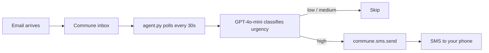

# SMS Alert Agent — Email Monitoring with SMS Notifications

Monitors an email inbox and sends SMS alerts when urgent emails arrive. Uses Commune's unified email + SMS API.

## Architecture



## Setup

**1. Install dependencies**

```bash
pip install -r requirements.txt
```

**2. Configure environment**

```bash
cp .env.example .env
# Fill in COMMUNE_API_KEY, OPENAI_API_KEY, ALERT_PHONE
```

Get a Commune API key at [commune.sh](https://commune.sh). Provision a phone number in the Commune dashboard before running.

**3. Run**

```bash
python agent.py
```

The agent creates (or reuses) a `monitoring` inbox, then polls every 30 seconds. Send a test email mentioning something urgent like "system is down" to trigger an SMS alert.

## How it works

The agent polls `commune.threads.list()` every 30 seconds. For each new inbound thread it hasn't seen before, it:

1. Loads the most recent inbound message with `commune.threads.messages()`
2. Sends the subject and first 500 characters to GPT-4o-mini for urgency classification
3. If urgency is `"high"`, calls `commune.sms.send()` to deliver an SMS alert to your configured phone number

The SMS body is truncated to 160 characters to ensure single-segment delivery.

### Urgency classification

GPT-4o-mini returns structured JSON:

```json
{
  "urgency": "high",
  "reason": "System outage reported by customer",
  "summary": "Customer reports production API returning 500 errors"
}
```

The agent only sends SMS for `"high"` urgency. Adjust the prompt in `classify_urgency()` to tune the threshold for your use case.

## Customisation

- **Monitor multiple inboxes** — call `get_inbox()` with different names and poll each one in the loop.
- **Route by sender** — check `sender` before alerting to only notify for specific customers or domains.
- **Reply via SMS reply** — combine with `sms/two-way-sms/` to let you respond to the email by replying to the SMS alert.
- **Adjust polling interval** — change `time.sleep(30)` to poll more or less frequently.
- **Add email auto-reply** — call `commune.messages.send()` alongside the SMS to acknowledge receipt to the sender.
