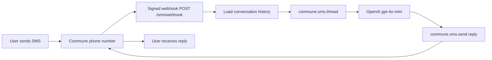

# Two-Way SMS Agent — TypeScript

Receive and reply to SMS messages using an AI agent. The SMS equivalent of the email webhook handler — uses `commune.sms.send()` and `commune.phoneNumbers.setWebhook()`.

## Architecture



## Setup

**1. Install dependencies**

```bash
npm install
```

**2. Configure environment**

```bash
cp .env.example .env
# Fill in COMMUNE_API_KEY and OPENAI_API_KEY
```

Get a Commune API key at [commune.sh](https://commune.sh).

**3. Provision a phone number**

Go to the Commune dashboard and provision a phone number. The agent picks up the first available number automatically.

**4. Register the webhook**

Run this once:

```typescript
import { CommuneClient } from 'commune-ai';
const commune = new CommuneClient({ apiKey: process.env.COMMUNE_API_KEY! });

const numbers = await commune.phoneNumbers.list();
await commune.phoneNumbers.setWebhook(numbers[0].id, {
  endpoint: 'https://your-app.railway.app/sms/webhook',
  events: ['sms.received'],
});

console.log(`Phone number: ${numbers[0].number}`);
```

**5. Run**

```bash
npm run dev
```

**6. Test**

Text your Commune phone number. The agent will reply within a few seconds.

For local development, expose with [ngrok](https://ngrok.com):

```bash
ngrok http 3000
# Use the https URL as your webhook endpoint
```

## How it works

### Conversation history

Each inbound SMS is paired with its full conversation history via `commune.sms.thread(from, phoneNumberId)`. This returns all past messages between your number and the sender, giving the LLM context for multi-turn conversations.

### Reply format

The system prompt instructs the LLM to keep replies under 160 characters and avoid markdown. SMS has no formatting support — plain text only. Messages longer than 160 characters are split into multiple segments by carriers; the agent aims to avoid this.

### No signature verification

Unlike email webhooks, this example omits HMAC verification for brevity. For production, add HMAC verification using the same `verifyCommuneWebhook` pattern shown in `typescript/webhook-handler/`.

## Customisation

- **Change the persona** — edit the `system` message in the `openai.chat.completions.create` call.
- **Add keyword triggers** — check `body.toLowerCase().includes('stop')` to handle opt-outs.
- **Combine with email** — use `commune.messages.send()` alongside the SMS reply to create a cross-channel notification trail.
- **Rate limiting** — add a per-sender rate limit map to prevent runaway conversation loops.
