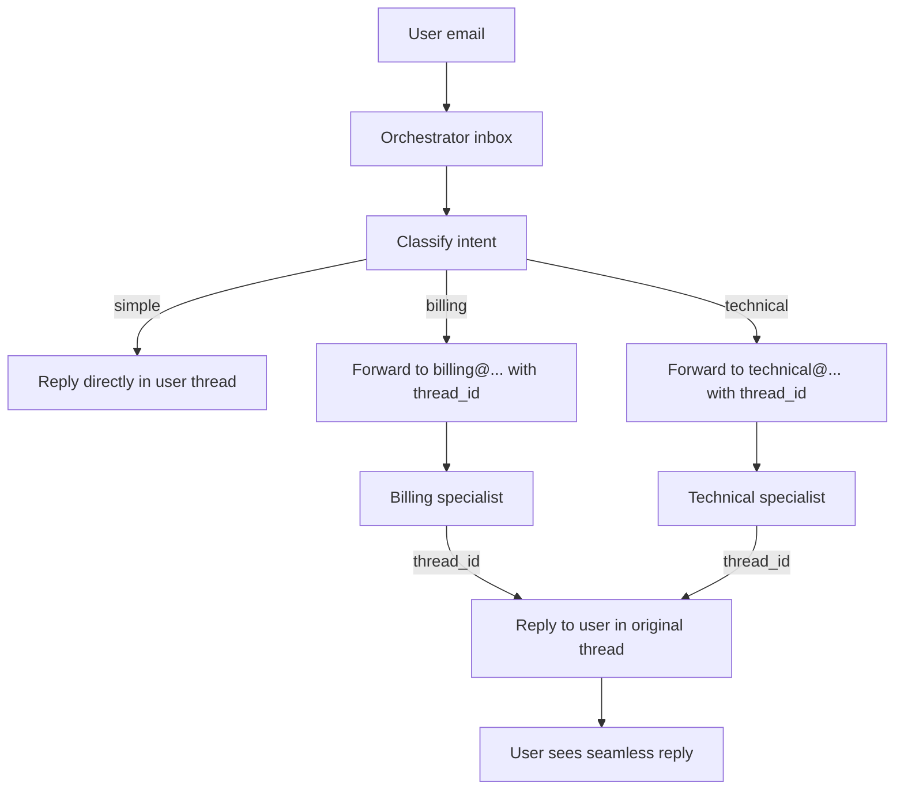

# Multi-Agent Email Coordination in TypeScript

Three agents collaborate by passing messages through real email threads — the same way humans escalate and hand off.

## How it works

The **orchestrator** receives user emails, classifies intent, and either replies directly (for simple queries) or forwards the task to a **specialist**. The specialist replies directly to the user in their original thread. The user sees a seamless conversation; the routing is invisible.

The coordination primitive is `thread_id`. The orchestrator embeds the user's original `thread_id` in the forwarded email. The specialist extracts it and passes it to `commune.messages.send()`, putting the reply directly in the user's thread — with no shared database, message queue, or custom protocol.



## Why this is powerful

- **Full email audit trail** — every handoff is a real email, readable in any email client
- **RFC 5322 threading** — replies are threaded correctly by message-id headers automatically
- **No shared infrastructure** — agents don't share a database or message bus; the email thread is the coordination layer
- **Human escalation is trivial** — a human can reply to any thread in the chain to intervene

## Setup

**1. Install dependencies**

```bash
npm install
```

**2. Create three inboxes and register webhook URLs**

Run this setup script once:

```typescript
import { CommuneClient } from 'commune-ai';
const commune = new CommuneClient({ apiKey: process.env.COMMUNE_API_KEY! });

const baseUrl = 'https://your-app.railway.app';

const orchestrator = await commune.inboxes.create({ localPart: 'support' });
await commune.inboxes.setWebhook(orchestrator.domainId, orchestrator.id, {
  endpoint: `${baseUrl}/webhook/orchestrator`,
  events: ['email.received'],
});

const billing = await commune.inboxes.create({ localPart: 'billing' });
await commune.inboxes.setWebhook(billing.domainId, billing.id, {
  endpoint: `${baseUrl}/webhook/billing`,
  events: ['email.received'],
});

const technical = await commune.inboxes.create({ localPart: 'technical' });
await commune.inboxes.setWebhook(technical.domainId, technical.id, {
  endpoint: `${baseUrl}/webhook/technical`,
  events: ['email.received'],
});

console.log('Orchestrator:', orchestrator.address);
console.log('Billing specialist:', billing.address);
console.log('Technical specialist:', technical.address);
```

**3. Configure environment**

```bash
cp .env.example .env
# Fill in keys and the specialist inbox addresses from step 2
```

**4. Run**

```bash
npm run dev
```

**5. Test**

Send an email to your orchestrator inbox address. Try a billing question and a technical question to see the routing in action.

## Agent roles

### Orchestrator (`/webhook/orchestrator`)

Receives all user emails. Uses GPT-4o-mini to classify intent into three categories:

| Intent | Action |
|--------|--------|
| `simple` | Generates and sends a direct reply |
| `billing` | Forwards to billing specialist inbox with task payload |
| `technical` | Forwards to technical specialist inbox with task payload |

The forwarded email contains a `TASK_PAYLOAD:` line with the user's email address, original subject, and — critically — the original `thread_id`.

### Specialists (`/webhook/billing`, `/webhook/technical`)

Each specialist:
1. Extracts the `ForwardedTaskPayload` from the email body
2. Loads the full user thread history via `commune.threads.messages(originalThreadId)`
3. Generates an expert reply using a domain-specific system prompt
4. Sends the reply to the **user** (not the orchestrator) using the `originalThreadId`
5. Marks the thread as `closed`

The user receives a reply that appears to come from a unified support team, directly in their original thread.

## Customisation

- **Add more specialists** — create a new inbox, register its webhook, mount another `createSpecialistRouter()` call, and add the intent to the orchestrator's classification prompt.
- **Richer forwarded context** — extend `ForwardedTaskPayload` with additional fields (e.g., account ID from extracted data) to give specialists more context.
- **Human-in-the-loop** — instead of replying automatically, have the specialist send a draft email to a human reviewer's inbox; the human edits and sends.
- **Status tracking** — use `commune.threads.addTags()` to label threads with the routing path for analytics.
