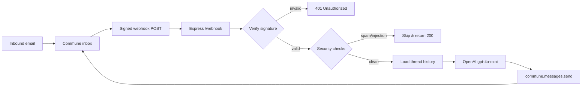

# TypeScript Webhook Handler for Commune Email

The building block for any TypeScript AI agent that receives email. Handles webhook verification, thread routing, security checks, and reply sending.

## Architecture

Inbound email arrives at your Commune inbox. Commune signs the payload and delivers it to your Express server. Your handler verifies the signature, checks security flags, loads thread history, generates a reply with OpenAI, and sends it back — all in the same thread.



## Setup

**1. Install dependencies**

```bash
npm install
```

**2. Configure environment**

```bash
cp .env.example .env
# Fill in COMMUNE_API_KEY, COMMUNE_WEBHOOK_SECRET, OPENAI_API_KEY
```

Get a Commune API key at [commune.sh](https://commune.sh).

**3. Create an inbox and register the webhook URL**

Run this once from a script or the Node REPL:

```typescript
import { CommuneClient } from 'commune-ai';
const commune = new CommuneClient({ apiKey: process.env.COMMUNE_API_KEY! });

const inbox = await commune.inboxes.create({ localPart: 'support' });

await commune.inboxes.setWebhook(inbox.domainId, inbox.id, {
  endpoint: 'https://your-app.railway.app/webhook',
  events: ['email.received'],
});

console.log(`Inbox address: ${inbox.address}`);
// → support@your-domain.commune.email
```

**4. Run the server**

```bash
# Development (auto-restarts on file changes)
npm run dev

# Production
npm run build && npm start
```

**5. Test it**

Send an email to your inbox address. You should see a reply within a few seconds.

For local development, expose your server with [ngrok](https://ngrok.com):

```bash
ngrok http 3000
# Use the https URL as your webhook endpoint
```

## How it works

### Signature verification

Commune signs every webhook with HMAC-SHA256. The `verifyCommuneWebhook` helper from `commune-ai` checks the `x-commune-signature` and `x-commune-timestamp` headers against the raw request body. We mount `express.raw()` on the `/webhook` route before the JSON parser so the raw bytes are preserved for verification.

### Security checks

Commune automatically scans every inbound email for spam and prompt injection. The webhook payload includes a `security` object with scores and flags. This handler skips processing for flagged spam and medium/high/critical prompt injection — protecting your LLM from adversarial inputs.

### Thread continuity

Passing `thread_id` to `commune.messages.send()` keeps the reply in the same email thread. The sender sees it as a reply in their inbox, and Commune groups it with the original conversation in your dashboard.

### Async processing

The handler sends `200 OK` immediately after verifying the signature, then processes the email asynchronously. This prevents Commune from timing out and retrying the webhook if your LLM call takes a few seconds.

## Customisation

- **Change the model** — update `model: 'gpt-4o-mini'` in the `openai.chat.completions.create` call.
- **Add tools / structured output** — extend the OpenAI call with `tools` or `response_format` for function calling.
- **Custom system prompt** — edit the `system` message content to match your use case.
- **Thread tagging** — add more tags in the `commune.threads.addTags` call based on extracted data.
- **Status transitions** — change the `setStatus` call to `'closed'` if no further replies are expected, or `'needs_reply'` to flag for human review.
