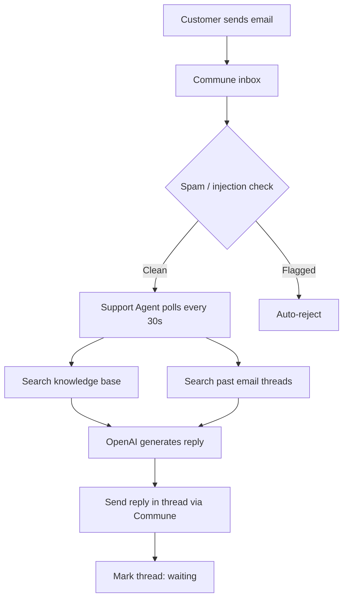

# AI Email Support Agent

Full customer support agent with email inbox, knowledge base search, thread-aware replies, and automatic ticket routing. Zero framework dependencies — just Python and Commune.

## How it works



Commune performs spam and prompt-injection checks on every inbound email before your agent ever sees it. Clean emails land in your inbox; flagged ones are rejected automatically.

## Step by step

1. On startup, `get_or_create_inbox("support")` resolves or creates a `support@...` inbox — idempotent, safe to re-run.
2. The polling loop calls `commune.threads.list()` every 30 seconds and filters for threads where `last_direction == "inbound"` (i.e. the customer sent the last message).
3. For each unhandled thread, the agent loads all messages, extracts the sender's email, and finds the most recent inbound message.
4. The knowledge base is searched by globbing `knowledge_base/*.md` and injecting relevant file content.
5. `commune.search.threads()` performs semantic search across past threads so the agent can reference how similar issues were resolved before.
6. OpenAI `gpt-4o-mini` receives the full thread history, KB context, and past-thread context, then generates a reply.
7. The reply is sent via `commune.messages.send(..., thread_id=...)` — this keeps it in the same email chain rather than starting a new one.
8. Handled thread IDs are tracked in memory so they are not processed again in the same session.

## Setup

**1. Install dependencies**

```bash
pip install -r requirements.txt
```

**2. Set environment variables**

```bash
cp .env.example .env
# Edit .env and fill in COMMUNE_API_KEY and OPENAI_API_KEY
```

Or export directly:

```bash
export COMMUNE_API_KEY=comm_...
export OPENAI_API_KEY=sk-...
```

Get a Commune API key at [commune.sh](https://commune.sh).

**3. Add your knowledge base docs**

Drop Markdown files into `knowledge_base/`. Two examples are included:

- `knowledge_base/product.md` — product FAQ
- `knowledge_base/billing.md` — billing policies and pricing

The agent reads all `.md` files in that folder at reply time.

**4. Run**

```bash
python agent.py
```

The agent prints your inbox address on startup. Send an email to it and watch it respond within 30 seconds.

## What to customize

| Thing | Where |
|-------|-------|
| System prompt / persona | `SYSTEM_PROMPT` constant in `agent.py` |
| Knowledge base content | Files in `knowledge_base/` |
| Poll interval | `time.sleep(30)` in `main()` |
| Model | `model="gpt-4o-mini"` in the OpenAI call |
| Inbox name | `get_or_create_inbox("support")` in `main()` |

## Key features

> **Thread-aware** — replies stay in the same email chain. Customers see a single coherent conversation, not a flood of new emails.

> **Spam-filtered** — Commune checks every inbound email for spam and prompt injection before your agent sees it. The `security` field on each message carries the verdict.

> **Semantic search** — `commune.search.threads()` finds past relevant threads using vector similarity. The agent can reference how similar issues were resolved.
