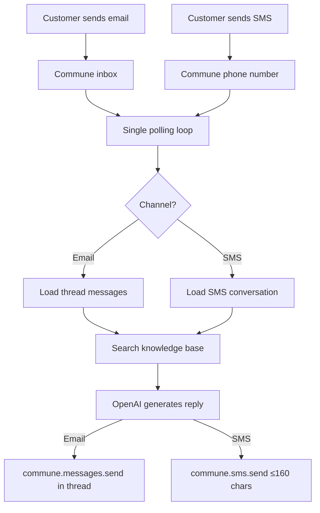

# Omnichannel Support Agent — Email + SMS

One agent handles both email and SMS. Unified conversation history. Customers can start on email, continue on SMS.

## How it works



Commune's unified Python client handles both channels. The same agent loop, the same OpenAI call, the same knowledge base — just different send paths at the end.

## The key insight

The `commune-mail` Python client exposes email and SMS through a single `CommuneClient`. This means one polling loop can handle both:

```python
# One client, two channels
commune = CommuneClient(api_key=os.environ["COMMUNE_API_KEY"])

# Email
email_threads = commune.threads.list(inbox_id=inbox_id)
# SMS
sms_convos = commune.sms.conversations(phone_number_id=phone_id)
```

The `handle_email()` and `handle_sms()` functions are unified behind the same `generate_reply()` call — same LLM, same system prompt, same knowledge base. Only the character limit and send function differ.

## Setup

**1. Install dependencies**

```bash
pip install -r requirements.txt
```

**2. Set environment variables**

```bash
cp .env.example .env
# Fill in COMMUNE_API_KEY and OPENAI_API_KEY
```

Get a Commune API key at [commune.sh](https://commune.sh).

**3. Provision a phone number**

Go to the [Commune dashboard](https://commune.sh/dashboard) and provision a phone number. The agent picks up the first available number automatically.

**4. Add your knowledge base (optional)**

Copy the `knowledge_base/` folder from `../email-support-agent/` or create your own `.md` files. The agent reads all `.md` files in that folder.

```bash
cp -r ../email-support-agent/knowledge_base ./knowledge_base
```

**5. Run**

```bash
python agent.py
```

The agent prints both the email inbox address and the SMS phone number on startup. Test it by emailing the inbox or texting the phone number.

## When to use this vs. the single-channel examples

| Scenario | Use |
|----------|-----|
| Email support only | [email-support-agent/](../email-support-agent/) |
| SMS support only | [sms-support/](../sms-support/) |
| Both email and SMS | This example |
| Event-driven (webhook) instead of polling | [sms-support/](../sms-support/) |

## Customization

| Thing | Where |
|-------|-------|
| System prompt | `SYSTEM_PROMPT` in `agent.py` |
| Knowledge base | Files in `knowledge_base/` |
| Poll interval | `time.sleep(30)` in `main()` |
| SMS character limit | `max_sms_chars` parameter in `handle_sms_conversation()` |
| Model | `model="gpt-4o-mini"` in `generate_reply()` |
