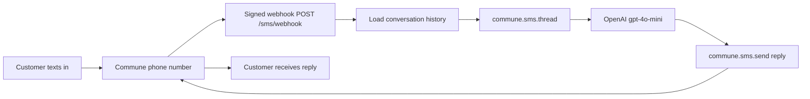

# SMS Customer Support Agent

Give your support team an AI-powered SMS line. Customers text in, the agent replies — with full conversation history and OpenAI.

## How it works



Commune routes every inbound SMS to your webhook. The handler loads the full conversation history, builds an OpenAI chat from it, generates a reply, and sends it back — all within a few seconds.

## Setup

**1. Install dependencies**

```bash
npm install
```

**2. Configure environment**

```bash
cp .env.example .env
# Fill in COMMUNE_API_KEY and OPENAI_API_KEY
```

Get a Commune API key at [commune.sh](https://commune.sh).

**3. Provision a phone number**

Go to the [Commune dashboard](https://commune.sh/dashboard) and provision a phone number. The agent automatically uses the first number on your account.

**4. Register the webhook**

Run this once to point your phone number at your server:

```typescript
import { CommuneClient } from 'commune-ai';
const commune = new CommuneClient({ apiKey: process.env.COMMUNE_API_KEY! });

const numbers = await commune.phoneNumbers.list();
await commune.phoneNumbers.setWebhook(numbers[0].id, {
  endpoint: 'https://your-app.railway.app/sms/webhook',
  events: ['sms.received'],
});

console.log(`Webhook set for ${numbers[0].number}`);
```

For local development, expose your server with [ngrok](https://ngrok.com):

```bash
ngrok http 3000
# Use the https:// URL as your webhook endpoint above
```

**5. Run**

```bash
npm run dev
```

**6. Test**

Text your Commune phone number. The agent will reply within a few seconds.

## Use cases

- **Support hotline** — customers text questions, the agent answers using your knowledge base
- **Order status** — customers text an order number, the agent looks it up
- **Appointment confirmations** — two-way SMS for scheduling flows
- **After-hours coverage** — the agent handles inbound messages 24/7 while your human team sleeps

## How conversation history works

Each inbound SMS triggers a call to `commune.sms.thread(fromNumber, phoneNumberId)`. This returns every message exchanged between your number and the customer — both inbound and outbound — in chronological order. The handler maps this history to OpenAI `user`/`assistant` turns so the LLM has full context for multi-turn conversations.

## Customization

| Thing | Where |
|-------|-------|
| Agent persona / instructions | `system` message in `src/index.ts` |
| Character limit | `content` of system message |
| Model | `model: 'gpt-4o-mini'` in the OpenAI call |
| Port | `PORT` env var (default: 3000) |
