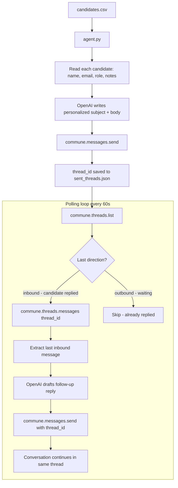

# AI Candidate Outreach Agent

AI recruiter that emails candidates, monitors replies, and sends follow-ups — powered by Commune email threading.

Each candidate gets a personalized outreach email written by OpenAI. Replies are detected automatically and the agent continues the conversation in the same thread. No separate database needed — Commune's `thread_id` keeps each candidate's history organized.

---

## How it works



---

## Files

```
candidate-email-outreach/
├── agent.py             # Sends outreach, polls for replies, continues conversations
├── candidates.csv       # Candidate list with name, email, role, source, notes
├── requirements.txt
└── .env.example
```

`sent_threads.json` is created automatically when outreach is sent. It maps each candidate's email to their Commune `thread_id`.

---

## Key concept: thread_id

Every email sent through Commune returns a `thread_id`. When a candidate replies, Commune groups that reply into the same thread. By passing the same `thread_id` back to `commune.messages.send()`, every follow-up lands in the same conversation — both in the candidate's inbox (as a reply chain) and in Commune's thread view.

This means the agent never needs a database. The thread is the conversation record.

---

## Setup

**1. Install dependencies**

```bash
pip install -r requirements.txt
```

**2. Configure environment**

```bash
cp .env.example .env
# Fill in COMMUNE_API_KEY, OPENAI_API_KEY, RECRUITER_NAME, RECRUITER_EMAIL
```

**3. Add candidates**

Edit `candidates.csv` with real candidates, or use the sample data for testing. The agent reads it on each run, so add new rows at any time.

**4. Run the agent**

```bash
python agent.py
```

The agent sends outreach to any candidate in `candidates.csv` who hasn't been contacted yet, then enters a polling loop checking for replies every 60 seconds.

---

## Customisation

**Outreach tone** — edit the `write_outreach_email()` prompt to match your brand voice, role type, or industry.

**Follow-up logic** — the `write_follow_up()` prompt receives the full thread history. Adjust the system prompt to route replies differently: schedule an interview, answer questions, or hand off to a human.

**Polling interval** — change `time.sleep(60)` in the main loop to poll more or less frequently. For high-volume recruiting, lower it to 30 seconds.

**Multi-role campaigns** — run multiple instances of `agent.py` with different `candidates.csv` files and different `RECRUITER_EMAIL` inboxes (one per role) to keep outreach organized by position.
