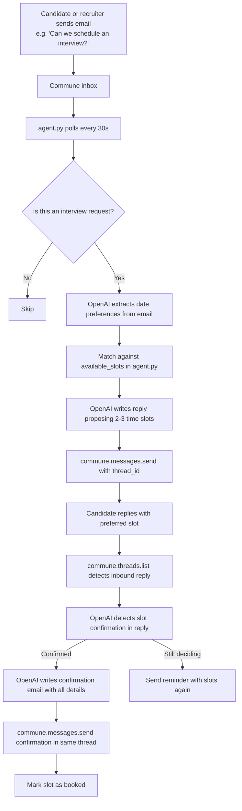

# AI Interview Scheduler

Agent that monitors an inbox for interview requests, proposes available time slots, and confirms bookings — all within a single email thread via Commune.

No scheduling app or calendar integration required for the demo. Slots are hardcoded and can be swapped for a real calendar API (Google Calendar, Cal.com) in production.

---

## How it works



---

## Files

```
interview-scheduler/
├── agent.py        # Main agent: polls inbox, proposes slots, confirms bookings
├── requirements.txt
└── .env.example
```

---

## Setup

**1. Install dependencies**

```bash
pip install -r requirements.txt
```

**2. Configure environment**

```bash
cp .env.example .env
# Fill in COMMUNE_API_KEY, OPENAI_API_KEY, INTERVIEWER_NAME, COMPANY_NAME
```

**3. Edit available slots**

Open `agent.py` and update the `AVAILABLE_SLOTS` list near the top of the file with real dates and times.

**4. Run the agent**

```bash
python agent.py
```

The agent creates (or reuses) a `scheduling` inbox and prints its address. Send an email to that address mentioning an interview to test it.

**Test email example:**
```
To: scheduling@your-subdomain.commune.email
Subject: Interview for Backend Engineer role

Hi, I'd like to schedule an interview for the backend engineering position. I'm generally available in the mornings next week. Let me know what works.

Thanks,
Jordan
```

---

## Customisation

**Real calendar integration** — replace the `AVAILABLE_SLOTS` list with a call to Google Calendar's freebusy API or Cal.com's availability endpoint. Pass real available windows to the slot-selection prompt.

**Multiple interviewers** — add an `interviewer` field to each slot and route confirmations to the right person's email.

**Timezone handling** — add a `timezone` field to the request detection prompt and normalize all times to UTC before comparing against slots.

**Cancellation and rescheduling** — add a classification step that detects "cancel" or "reschedule" intent and handles those flows in the same thread.
