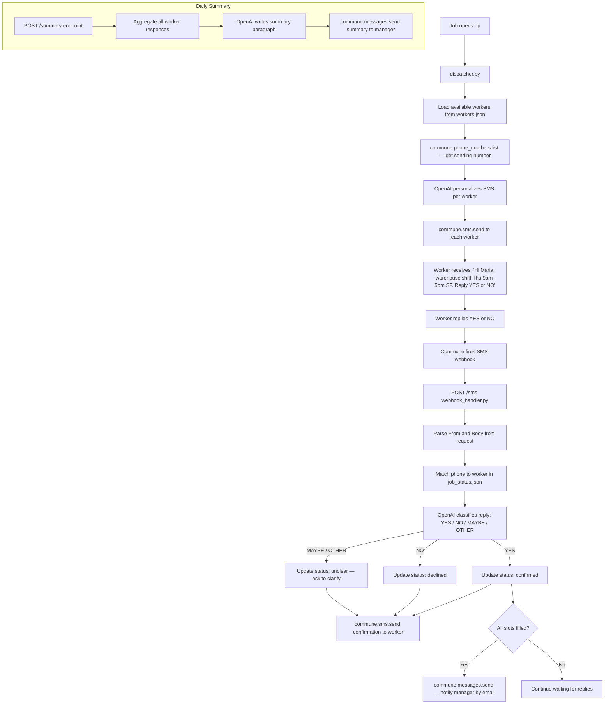

# AI Worker Dispatch via SMS — Staffing & Gig Platform

AI agent dispatches jobs to workers via SMS, collects availability responses via webhook, tracks status, and emails managers daily summaries.

Built on [Commune](https://commune.sh) for SMS send/receive and email. No separate messaging infrastructure required.

---

## How it works



---

## Files

```
sms-worker-dispatch/
├── dispatcher.py         # Sends job dispatch SMS to all available workers
├── webhook_handler.py    # Flask server: receives replies, updates status, auto-replies, alerts manager
├── workers.json          # Worker pool with name, phone, skills, status
├── requirements.txt
└── .env.example
```

`job_status.json` is created automatically by `dispatcher.py` when a job is dispatched. It tracks every worker's response and is read/updated by `webhook_handler.py`.

---

## Setup

**1. Install dependencies**

```bash
pip install -r requirements.txt
```

**2. Configure environment**

```bash
cp .env.example .env
# Fill in COMMUNE_API_KEY, OPENAI_API_KEY, MANAGER_EMAIL, MANAGER_PHONE
```

Get a Commune API key at [commune.sh](https://commune.sh). Provision a phone number in the Commune dashboard — this is the number your workers will receive SMS from (and reply to).

**3. Load your worker data**

Edit `workers.json` with real worker names and phone numbers, or leave the sample data in place for testing.

**4. Dispatch a job**

```bash
python dispatcher.py \
  --job "Warehouse Packer" \
  --date "Thursday Jan 16, 9am-5pm" \
  --location "SF Warehouse, 123 Main St"
```

This sends a personalized SMS to every worker with `"status": "available"` and writes `job_status.json`.

**5. Start the webhook handler**

```bash
python webhook_handler.py
```

Expose it publicly so Commune can deliver inbound SMS events. For local development:

```bash
# Using ngrok
ngrok http 3000
# Copy the https URL, e.g. https://abc123.ngrok.io
```

**6. Register the webhook in Commune**

Point Commune's SMS webhook at your handler. Do this once in code or from the dashboard:

```python
from commune import CommuneClient
commune = CommuneClient(api_key="comm_...")
numbers = commune.phone_numbers.list()
commune.phone_numbers.set_webhook(
    numbers[0].id,
    endpoint="https://abc123.ngrok.io/sms",
    events=["sms.received"],
)
```

Workers can now reply and their responses will be captured automatically.

**7. Trigger a summary (optional)**

```bash
curl -X POST http://localhost:3000/summary
```

Sends an email to `MANAGER_EMAIL` with a breakdown of all worker responses.

---

## Step-by-step walkthrough

### 1. Dispatching a job

`dispatcher.py` runs as a one-shot script. When you call it with a job, date, and location it:

1. Loads all workers from `workers.json` and filters to `"status": "available"`
2. Calls `commune.phone_numbers.list()` to get your sending number
3. For each worker, asks OpenAI to write a short personalized SMS (under 160 chars) — friendly, first name, job details, "reply YES or NO"
4. Calls `commune.sms.send()` for each worker with a 0.5 second delay between sends
5. Writes `job_status.json` with the job details and every worker who was messaged

### 2. Receiving replies

When a worker replies, Commune fires a `POST /sms` to your webhook handler. The payload is URL-encoded (Twilio-style):

```
From=+14155550101&To=+14155559000&Body=YES&MessageSid=SM...
```

`webhook_handler.py`:

1. Acknowledges the request immediately with `200 OK` (before doing any processing)
2. Looks up the worker by their phone number in `job_status.json`
3. Sends the reply text to OpenAI to classify as `YES`, `NO`, `MAYBE`, or `OTHER`
4. Updates that worker's entry in `job_status.json`
5. Sends a confirmation SMS back to the worker
6. If the reply was YES and all required slots are now filled, emails the manager via `commune.messages.send()`

### 3. Daily summary

`POST /summary` can be called by a cron job or manually. It:

1. Reads the current `job_status.json`
2. Asks OpenAI to write a clean summary paragraph
3. Sends it to the manager's email address via Commune

---

## Customisation

**Worker data format** — `workers.json` supports any extra fields you need. Add `hourly_rate`, `certifications`, `preferred_locations`, etc. and reference them in the `personalize_sms()` prompt to make outreach more targeted.

**Slots required** — Set `SLOTS_REQUIRED` in `.env` to control how many YES responses trigger the "job filled" manager notification.

**Multiple job types** — Run `dispatcher.py` multiple times with different `--job` arguments. Each run overwrites `job_status.json`, so run one job at a time, or change `STATUS_FILE` to include the job name.

**Manager email** — Set `MANAGER_EMAIL` in `.env`. The handler and summary both read from this variable. Add multiple recipients by comma-separating in the env var and splitting in code.

**Webhook security** — Add a `COMMUNE_WEBHOOK_SECRET` to your `.env` and validate inbound requests using `verifyCommuneWebhook` (TypeScript) or check the `X-Commune-Signature` header (Python) before processing.

**Scaling** — For large worker pools (100+), replace `workers.json` with a database query and consider running `dispatcher.py` in async batches. The webhook handler is stateless and can run on multiple instances behind a load balancer.
