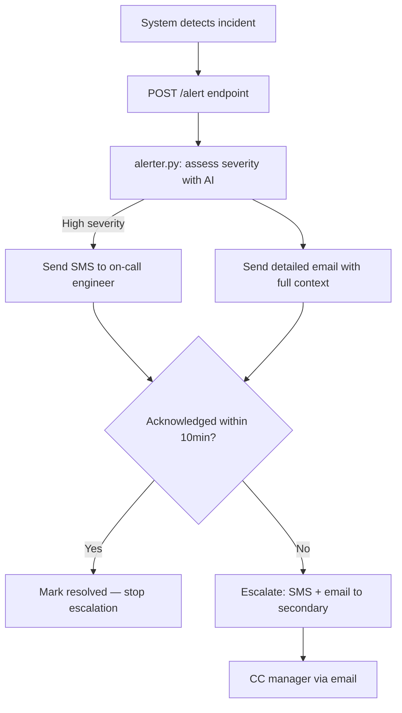

# Incident Alert Agent — Email + SMS On-Call Notifications

When your system detects an incident, this agent sends email + SMS to the on-call engineer. They can acknowledge via reply. Escalates to secondary on-call if no response in 10 minutes.

```
flowchart TD
    A[System detects incident] --> B[POST /alert endpoint]
    B --> C[alerter.py: assess severity with AI]
    C -->|High severity| D[Send SMS to on-call engineer]
    C --> E[Send detailed email with full context]
    D & E --> F{Acknowledged within 10min?}
    F -->|Yes| G[Mark resolved — stop escalation]
    F -->|No| H[Escalate: SMS + email to secondary]
    H --> I[CC manager via email]
```



---

## Why two channels?

**SMS** = immediate interrupt. On-call engineers see it even when they're not at their desk.

**Email** = full context. Runbook link, stack trace, affected services — everything the engineer needs to diagnose and fix.

Together: SMS gets their attention in seconds, email gives them everything they need when they open their laptop.

---

## How it works

1. Your monitoring system (Datadog, PagerDuty, custom webhook, anything) POSTs to `/alert`
2. The agent calls OpenAI to assess severity and write a clear, actionable summary
3. SMS goes out immediately for high-severity incidents
4. Detailed email goes to the on-call inbox with full context + runbook link
5. A background thread watches for acknowledgment — if the engineer replies "ACK" or "acknowledged", escalation stops
6. After 10 minutes without acknowledgment, the agent escalates: SMS + email to secondary on-call, CC to manager

---

## Quickstart

```bash
git clone https://github.com/commune-email/examples
cd examples/use-cases/notifications-and-alerts/incident-alerts
cp .env.example .env
# Fill in your keys
pip install -r requirements.txt
python alerter.py
```

Then send a test alert:

```bash
curl -X POST http://localhost:5000/alert \
  -H "Content-Type: application/json" \
  -d '{
    "title": "Database connection pool exhausted",
    "severity": "high",
    "details": "pg_pool.max=20, active=20, waiting=47. Started 3min ago.",
    "runbook_url": "https://notion.so/your-runbook"
  }'
```

---

## Integration

Point your monitoring system's webhook at `POST /alert`. The payload shape:

```json
{
  "title": "Short incident title",
  "severity": "low | medium | high | critical",
  "details": "Full description, stack trace, affected services — anything useful",
  "runbook_url": "https://..."
}
```

Works with:
- **Datadog** — Webhooks integration, point at your `/alert` URL
- **Grafana** — Contact points > Webhook
- **PagerDuty** — Use as an outbound webhook on escalation rules
- **Custom scripts** — `curl -X POST .../alert -d '...'`

---

## Acknowledgment

When an engineer replies to the alert email with "ACK", "acknowledged", or "resolved", the TypeScript webhook handler (`src/handler.ts`) receives the inbound email webhook from Commune and marks the alert as resolved in `alert_state.json`.

The Python escalation thread polls `alert_state.json` every 30 seconds — once it sees `acknowledged: true`, it stops.

---

## Configuration

| Variable | Description |
|---|---|
| `COMMUNE_API_KEY` | Your Commune API key (`comm_...`) |
| `COMMUNE_INBOX_ID` | Inbox ID for the alerts inbox |
| `COMMUNE_PHONE_NUMBER_ID` | Phone number ID for outbound SMS |
| `ONCALL_EMAIL` | Primary on-call engineer email |
| `ONCALL_PHONE` | Primary on-call phone (`+1...`) |
| `SECONDARY_EMAIL` | Secondary escalation email |
| `SECONDARY_PHONE` | Secondary escalation phone |
| `MANAGER_EMAIL` | Manager CC'd on escalation |
| `OPENAI_API_KEY` | OpenAI API key for severity assessment |
| `ESCALATION_MINUTES` | Minutes before escalation (default: 10) |

---

## Files

```
incident-alerts/
├── alerter.py          Python Flask server — receives alerts, sends notifications, handles escalation
├── src/handler.ts      TypeScript Express — receives acknowledgment webhooks from Commune
├── requirements.txt
├── package.json
└── .env.example
```
