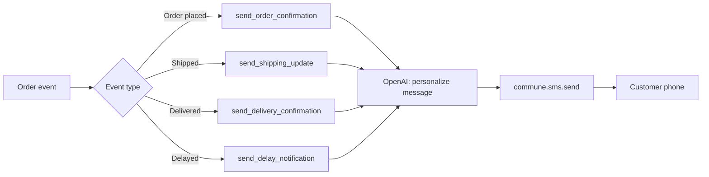

# Transactional SMS — Order Updates & Notifications

Send order confirmations, shipping updates, and delivery notifications via SMS. AI personalizes each message. Built on Commune's SMS API.



---

## Pattern overview

This is a pattern library, not a full agent — four functions you drop into whatever order management system you already have. Each function:

1. Takes structured order data
2. Calls OpenAI to generate a concise, personalized SMS (<160 chars)
3. Sends via `commune.sms.send()`
4. Returns the message SID

```python
from notifications import send_order_confirmation, send_shipping_update

# Order placed
send_order_confirmation(order=order_data, customer_phone="+14155551234")

# Order shipped
send_shipping_update(order=order_data, tracking=tracking_data, customer_phone="+14155551234")
```

---

## Notification types

### Order confirmation

Sent immediately when the order is placed.

```python
send_order_confirmation(
    order={"order_id": "ORD-8821", "items": ["Blue hoodie (L)", "Beanie"], "total": 89.00},
    customer_phone="+14155551234",
)
# → "Thanks for your order! ORD-8821 (Blue hoodie (L), Beanie) — $89.00. Ships in 1-3 days."
```

### Shipping update

Sent when the carrier picks up the package.

```python
send_shipping_update(
    order={"order_id": "ORD-8821", "items": ["Blue hoodie (L)"]},
    tracking={"carrier": "UPS", "tracking_number": "1Z9999W99999999999", "eta": "Feb 28"},
    customer_phone="+14155551234",
)
# → "ORD-8821 shipped via UPS. Track: 1Z9999W99999999999. Estimated delivery Feb 28."
```

### Delivery confirmation

Sent when the carrier marks the package as delivered.

```python
send_delivery_confirmation(
    order={"order_id": "ORD-8821", "items": ["Blue hoodie (L)"]},
    customer_phone="+14155551234",
)
# → "Your order ORD-8821 was delivered. Enjoy your Blue hoodie! Questions? Reply anytime."
```

### Delay notification

Sent when the estimated delivery date slips.

```python
send_delay_notification(
    order={"order_id": "ORD-8821", "items": ["Blue hoodie (L)"], "original_eta": "Feb 25"},
    new_eta="Mar 2",
    customer_phone="+14155551234",
)
# → "Heads up: ORD-8821 is running a bit late. New estimated delivery: Mar 2. Sorry for the wait!"
```

---

## Why AI-generated messages?

- Messages stay under 160 characters (no split-SMS billing surprises)
- Natural language adapts to item names, order context, and carrier names
- Delay messages include a genuine-sounding apology instead of boilerplate
- Easy to adjust tone by editing the system prompt in each function

---

## Quickstart

```bash
pip install -r requirements.txt
cp .env.example .env
# Fill in COMMUNE_API_KEY, COMMUNE_PHONE_NUMBER_ID, OPENAI_API_KEY
python notifications.py   # runs the example block
```

---

## Configuration

| Variable | Description |
|---|---|
| `COMMUNE_API_KEY` | Your Commune API key (`comm_...`) |
| `COMMUNE_PHONE_NUMBER_ID` | Phone number ID for outbound SMS |
| `OPENAI_API_KEY` | OpenAI API key for message generation |

Get your phone number ID:

```python
from commune import CommuneClient
commune = CommuneClient(api_key="comm_...")
numbers = commune.phone_numbers.list()
print(numbers[0].id, numbers[0].number)
```
