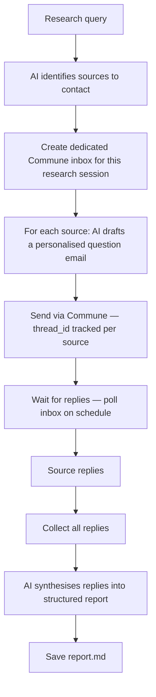

# AI Email Research Agent

Give your AI agent an email address and let it conduct research by emailing primary sources. The agent sends questions, collects replies, and synthesises findings into a structured markdown report.

## How it works



The agent uses the "agent with a persistent inbox" pattern: it creates a real email inbox (`research@yourdomain.commune.sh`), sends questions from it, and polls that inbox for replies. Sources reply to a real address and their responses land directly in the agent's inbox.

## Quickstart

```bash
pip install -r requirements.txt
cp .env.example .env
# Fill in COMMUNE_API_KEY and OPENAI_API_KEY
python agent.py --topic "Impact of LLMs on legal research workflows"
```

After sending, re-run at any time to collect replies and generate a report:

```bash
python agent.py --topic "Impact of LLMs on legal research workflows" --collect
```

## File overview

| File | Purpose |
|------|---------|
| `agent.py` | Main agent — identifies sources, sends questions, polls replies, generates report |
| `research_state.json` | Auto-generated — tracks inbox ID, thread IDs, reply status per source |
| `report.md` | Auto-generated — final synthesised report |
| `requirements.txt` | Python dependencies |
| `.env.example` | Required environment variables |

## Modes

**Send mode** (default) — creates an inbox, identifies sources, sends question emails:

```bash
python agent.py --topic "your research question"
```

**Collect mode** — polls for replies and regenerates the report:

```bash
python agent.py --topic "your research question" --collect
```

You can schedule `--collect` to run hourly via cron while waiting for replies.

## Key concepts

**Persistent inbox** — `commune.inboxes.create(local_part="research")` gives the agent a real, stable email address. Sources reply to a real inbox, not a no-reply address. The agent polls that inbox to collect responses.

**Thread tracking** — each outreach email's `thread_id` is saved in `research_state.json`. Polling checks `last_direction` per thread: if it's `inbound`, a reply has arrived.

**Synthesis** — once replies are collected, OpenAI reads all source responses in one context window and writes a structured markdown report with key findings, quotes, and a summary.

## Environment variables

```
COMMUNE_API_KEY=comm_...
OPENAI_API_KEY=sk-...
```
