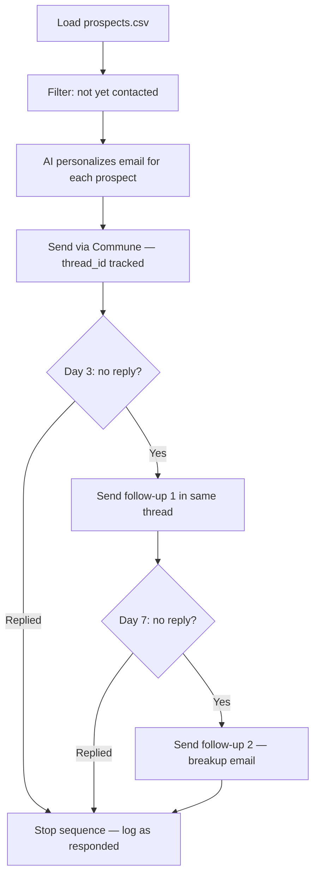

# AI Cold Outreach Sequence Agent

AI-powered SDR agent that runs personalized multi-step email sequences: initial outreach → follow-up 1 → follow-up 2. Monitors for replies and stops sequences when prospects respond.

## How it works



Commune's `thread_id` keeps the entire sequence inside **one email thread**. Prospects see a single conversation in their inbox — not three separate emails. The sequence stops the moment `last_direction == 'inbound'` — no more follow-ups sent to someone who already responded.

## Quickstart

```bash
pip install -r requirements.txt
cp .env.example .env
# Fill in COMMUNE_API_KEY, OPENAI_API_KEY, COMMUNE_INBOX_ID
python agent.py
```

Edit `prospects.csv` with real prospect data. Run the agent once per day (cron or manually) — it reads `sequence_state.json` to know what has already been sent and what's due next.

## File overview

| File | Purpose |
|------|---------|
| `agent.py` | Main agent loop — loads state, checks replies, sends due emails |
| `prospects.csv` | Prospect list: name, email, company, role, notes |
| `sequence_state.json` | Auto-generated — tracks thread IDs, steps, timestamps, reply status |
| `sequences/initial.txt` | Template for step 1 (initial outreach) |
| `sequences/followup_1.txt` | Template for step 2 (day 3 follow-up) |
| `sequences/followup_2.txt` | Template for step 3 (day 7 breakup email) |

## Key concepts

**Thread continuity** — Every follow-up is sent with the original `thread_id`. Prospects see one conversation; you avoid the awkward "just bumping this up" in a separate thread.

**Smart stopping** — Before sending any follow-up the agent checks `thread.last_direction`. If the prospect has replied (`inbound`), the sequence is marked complete and no more emails go out.

**State file** — `sequence_state.json` is the source of truth for what has been sent. Safe to re-run the agent multiple times per day — it is idempotent.

## Environment variables

```
COMMUNE_API_KEY=comm_...
COMMUNE_INBOX_ID=inbox_...
OPENAI_API_KEY=sk-...
FROM_NAME=Your Name
FROM_COMPANY=Your Company
```
