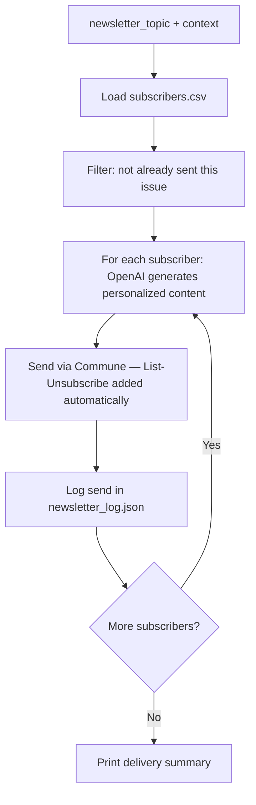

# AI Newsletter Agent

Generates and sends a personalized newsletter to every subscriber using OpenAI. Commune automatically adds RFC 8058 `List-Unsubscribe` headers on every send — CAN-SPAM and GDPR compliant with zero extra work.

## How it works



Each subscriber gets an email tailored to their listed interests — the same newsletter topic, but the examples and framing shift to match what each person cares about. Commune adds `List-Unsubscribe` and `List-Unsubscribe-Post` headers automatically, so unsubscribes work from any email client.

## Quickstart

```bash
pip install -r requirements.txt
cp .env.example .env
# Fill in COMMUNE_API_KEY, COMMUNE_INBOX_ID, OPENAI_API_KEY
python agent.py --topic "AI tools for developers" --issue 1
```

To send a test to a single address first:

```bash
python agent.py --topic "AI tools for developers" --issue 1 --test-email you@yourcompany.com
```

## File overview

| File | Purpose |
|------|---------|
| `agent.py` | Main script — loads subscribers, generates content, sends, logs |
| `subscribers.csv` | Subscriber list: name, email, interests |
| `newsletter_log.json` | Auto-generated — tracks which subscribers received which issue |
| `requirements.txt` | Python dependencies |
| `.env.example` | Required environment variables |

## Key features

**Personalisation** — OpenAI uses each subscriber's `interests` field to select relevant examples, headlines, and framing. Two subscribers reading issue 3 get the same headline stories but different supporting context.

**Idempotency** — `newsletter_log.json` records every (email, issue) pair that was sent. Re-running the script for the same issue skips already-sent subscribers safely.

**Unsubscribe compliance** — Commune adds RFC 8058 `List-Unsubscribe` and `List-Unsubscribe-Post` headers automatically. One-click unsubscribe works natively in Gmail, Apple Mail, and Outlook.

## Environment variables

```
COMMUNE_API_KEY=comm_...
COMMUNE_INBOX_ID=inbox_...
OPENAI_API_KEY=sk-...
NEWSLETTER_NAME=The Weekly Dispatch
FROM_NAME=Your Name
```
