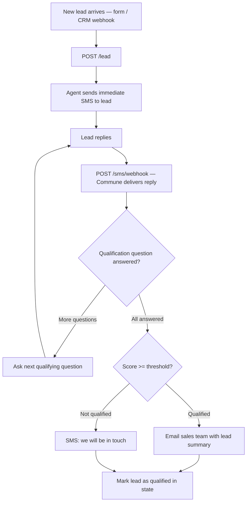

# SMS Lead Qualification Agent

When a new lead comes in, your AI agent texts them immediately — qualifies interest, budget, and timeline via SMS conversation. Qualified leads get emailed to your sales team.

SMS has a 98% open rate and an average response time under 3 minutes. By the time a sales rep picks up the phone, this agent has already filtered the list.

## How it works



## Quickstart

```bash
npm install
cp .env.example .env
# Fill in COMMUNE_API_KEY, COMMUNE_PHONE_NUMBER_ID, OPENAI_API_KEY, SALES_EMAIL, COMMUNE_INBOX_ID
npm run dev
```

Then expose your local server with [ngrok](https://ngrok.com) and configure the Commune SMS webhook to point to `https://your-ngrok-url/sms/webhook`.

Test it by sending a POST to `/lead`:

```bash
curl -X POST http://localhost:3000/lead \
  -H "Content-Type: application/json" \
  -d '{"name":"Alex","phone":"+15551234567","email":"alex@example.com","source":"website"}'
```

## Qualification logic

The agent runs up to three qualifying questions in sequence:

| # | Question | Qualifies if… |
|---|----------|---------------|
| 1 | Implementing within 3 months? | Replies YES |
| 2 | Budget range (< $5k / $5k–$20k / > $20k)? | $5k+ |
| 3 | Are you the decision maker? | Replies YES |

Each affirmative answer adds 1 to a score. Score ≥ 2 → email the sales team.

## File overview

| File | Purpose |
|------|---------|
| `src/index.ts` | Express server — `/lead` intake and `/sms/webhook` handler |
| `package.json` | Dependencies |
| `.env.example` | Required environment variables |

## Environment variables

```
COMMUNE_API_KEY=comm_...
COMMUNE_PHONE_NUMBER_ID=pn_...
COMMUNE_INBOX_ID=inbox_...
OPENAI_API_KEY=sk-...
SALES_EMAIL=sales@yourcompany.com
PORT=3000
```
